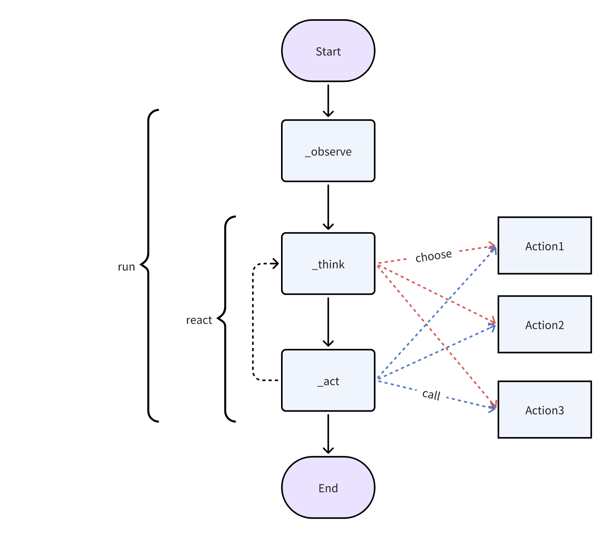

# SelfLearnAssis_BasedOnLanguageModel

### 项目目的
围绕Agents技术： 
1. 做一个工具（包含若干小工具），1）方便快速学习所搜集、汇聚来的资料；2）方便整理处理过的资料；同时方便读者、家入快速跟进知识体系。整理出来的资料以问答对的形式、或文档整合形式（问答太多时）呈现出来; 4）记录配置和开发的过程以及问题解决过程。 5）作为大模型、Agent这些发展迅速的领域的观察总结以及项目练手 
2. 利用自建的工具所搜集的资料整理成若干文档集、代码项目，其主要内容都是围绕 “Agent 的构建方式”和“使用这些Agent所需的基础设施如何构建”的。  

### 围绕Agents的文档大纲
关于Agent 和构建这些Agent所需的基础设施的文档简要大纲：  
 
借用metagpt 的老图作为 单Agent 的定义架构： 
单智能体 = LLM + 观察 + 思考 + 行动 (+ 记忆)  
 
本工程中构建的单智能体也是参照这个架构来构建的。 
其中的每一个模块（观察、思考、行动、记忆）都可以依赖或不依赖大模型。
拆分说明每一个模块： 
1. 观察：  
在原始的 metagpt 架构中各个单智能体通过接收上下游智能体发出的文字context信息+自己的记忆memory，来完成observe这个动作。 
主流的努力方向主要聚焦多模态输入，希望通过扩充输入模态，模拟人类的观察行为，更加全面的观察周围环境，用于后续决策。 
目前这个项目中的观察模块除了memory 和 context信息外，主要还使用了 MiniCPM 的模型来扩充额外输入。因为它的模型大小适宜，方便我在家里部署agent的backend。目前并未测试这个模型的能力边界。 MiniCPM-o是架构类似clip的多模态模型，其中的语言主干取自千问。关于多模态输入的MiniCPM-o模型的效果，一个直观的效果： 
>>> 输入： 
 
这是两只什么动物？猜测一下这两只动物之间是什么关系 
>>> 输出：   
这张图片展示的是两只小猫。它们看起来非常亲密，可能是一对兄弟姐妹或者是一对母子。 
从它们的姿势和表情来看，这两只小猫之间有一种温馨的关系，可能是父母与子女之间的关系，也可能是兄弟姐妹之间的亲密关系。这种场景通常会让人感到温暖和舒适。  实验详细文档见：[./doc/Readme_MiniCPM_O_exp.md](./doc/Readme_MiniCPM_O_exp.md)   

2. 思考： 
大模型的逻辑能力一直是我们最关注的点，对于Agents来说，决策与思考能力是提高Agents工作效率的关键。AI在这方面的能力由最初的隐性的逐步补全慢慢上升为关注焦点。举例：24年初时的语言大模型还不能玩如狼人杀之类的推理能力（即使把逻辑作为prompt，并给予充分的举例仍然不行）；24年中时，已经有团队利用Agents玩狼人杀游戏了，然而效果依然不尽人意；24年底的deepseek-R1和openAI o3 mini给到了我们新的视角，特别是 deepseek-R1-zero 为人们在特定的任务上提供了一种加速推理任务训练的新思路，有望更新“推理任务”与“计算、人力成本”的权衡估计方式。 
下面的文档将会涵盖一部分根据搜集来的数据和实践结果总结的“COT”和“大模型能力密度”的相关内容。由于DeepSeek V3 的结构对在节省算力、节省tensor间通信成本上有一定潜力，所以这里也做解读。 
思维链相关：[./doc/Readme_RLCOTStratege.md](./doc/Readme_RLCOTStratege.md)  
DeepSeek-V3结构相关：[./doc/Readme_RLCOTV3.md](./doc/Readme_RLCOTV3.md)  
DeepSeek-R1相关：[./doc/Readme_RLCOTDeepSeek.md](./doc/Readme_RLCOTDeepSeek.md)  

3. 行动： 
本工程中，行动模块主要体现在不同的单智能体的功能，这些功能包括下文内容<###Released Tool & 功能细节><###其他功能工具>; 
NOTE：1)11月开始学习开发RAG等相关功能，12月底时才发现豆包APP电脑版一定程度上涵盖了这些功能，且有更好的操作界面，所以推荐用豆包，少量需要定制的能力再自己开发。目前这里也有少部分文档是通过豆包APP易操作的界面汇总整理出来的。 
2)另外，用于爬取、搜集信息的工具也有推荐使用的开源工具补充：https://github.com/ericciarla/trendFinder   
3)关于各模型的编码能力，结合网上的测试和我实践中的一点测试。  
4. 记忆： 
记忆模块分长短期，我理解:短期多用上下文context，长期多用RAG接外接数据库来实现。 
同时也有修改网络结构实现修改网络记忆能力的实现与研究，见(这一模块同时要参考上面决策与逻辑的文档):   
5. 多智能体相关开发与研究： 

### 围绕 Agents 的技术栈
这里总结的都是截至到 2024年12月底为止的信息和知识。
#### 模型服务
#### 存储
#### 工具、库
#### Agent框架
#### Agent托管和Agent服务

### Agents本地部署的相关路径和准备
除了围绕Agents的实现之外，这个学习工程的实践过程中，遵循尽量将大模型 backend 部署在自己本地的方式。因此agent各个模块的选择偏好量化过的或者轻量的。这里我主要聚焦于方便部署的两个技术，即llama.cpp 和 最近流行的微型分布式部署框架vllm 以及 exo。  
适合本地部署：llama.cpp 是一个简洁、强大的大语言模型（不止llama，支持多种）部署框架，它基于ggml工程搭建，包含了量化、分布式部署等技术栈 
关于llama.cpp框架的详细解读见：[./doc/Readme_llamacpp.md](./doc/Readme_llamacpp.md)； 
关于llama.cppcuda 源码和算子的详细解读见：[./doc/Readme_llamacpp_cuda_kernel.md](./doc/Readme_llamacpp_cuda_kernel.md)； 
 
适合云端部署：vLLM 相关调研文档： 
 
适合内网异构族群部署：关于exo的实践过程和工程解读见： 

### 这个项目所基于的Agent框架的环境配置 & requirements
需要安装 metagpt ，安装方法见 https://docs.deepwisdom.ai/main/zh/guide/get_started/installation.html 
建议python <=3.12  >=3.9 
其他的见 requirements.txt 
另需安装： pip install 'metagpt[rag]' 
 
注意： 
安装时，当volcengine-python-sdk 编译出现问题时，可能原因是Windows路径长度限制： 
 
Windows系统有最长路径限制，这可能导致安装失败。可以通过修改注册表来解决这个问题。按下Win+R，输入regedit打开注册表编辑器，然后在HKEY_LOCAL_MACHINE\SYSTEM\CurrentControlSet\Control\FileSystem路径下的变量LongPathsEnabled设置为1 
 
然后重新运行一遍安装命令即可 
 

### Released Tool & 功能细节
1. RAG system implementing  
    使用案例见 [./RAGTool/Readme.md](./RAGTool/Readme.md) 中的详细使用记录(基于需要文件资料库的问答被记录了下来，当问答不准确时有纠正的问答对，可用作后续reranker和LLM的训练)  
    功能细节:  
    RAG system 中向量库主要由 FAISSVectorIndex，FAISSINDEXRetriver（faiss.IndexFlatL2）构成。 
    其中的向量编码模型（embedding model）根据 benchmark ：https://huggingface.co/spaces/mteb/leaderboard ， 选择了'sentence-transformers/all-MiniLM-L6-v2' ； 
    程序启动时，自动根据给定的地址中的所有文件构建database，进而构建RAG系统以及围绕RAG系统的问答系统； 
    操作界面基于实时对话，可在其中询问有关资料库的问题 
    注意：1）因为使用LLM Reranker，如果LLM回答的不对，可能会遇到IndexError: list index out of range；这个问题可能出现且暂时无法避免；2）目前我在大多数的学习案例和问答过程中使用了mistral-7b 的模型，其编程和理解代码的能力，在牵涉到代码细节的时候不能很好的给出解答（理解和推理），可以用新的code rag rerank 或者 底层换为gpt-4o解决。 
    目前的问题：1）对比市面上的国产大模型对话机器人仍有召回率低的问题，在两方面：细微用词偏差仍然有概率导致返回结果不准确，预计通过rerank增强context语境理解能力的方式可以解决这个问题。目前初步满足当下的学习需求；2）对于总结性的问题表现没有对于细节问题的把控表现好。可能需要通过重构summary功能的放入来接解决。 

2. dpo learning inserting  
    案例见 [./RAGTool/dpo/dpo.py](./RAGTool/dpo/dpo.py) 

### 其他功能工具
1. 简单自动写代码：./CodeWriter
2. 爬虫&搜集信息：./ScrapyAssistant
3. 自动写文档：./TechDocAssistant
4. 视频下载 & 视频音频转文字：搜集资料及使用RAG时，有视频资源，如./RAGTool/file/systemDesign 。为了方便归为文档资料，使用 [ScrapVideo.py, splitMp4Audio.py, Audio2text.py] 将视频资源转化为文档资料。其中音频转文档使用的是 Whisper 的模型 'distil-whisper/distil-small.en'; 值得一提，这个模型的采样频率是16000，因此需要将输入的音频频率也重采样到 16000

### TODO

3. markdown to mind map
4. user interface for friends to visit
5. multi-tier system inserting into RAG DB(url), agent self motivated visiting url, incase lacking of information
6. bilibili input

