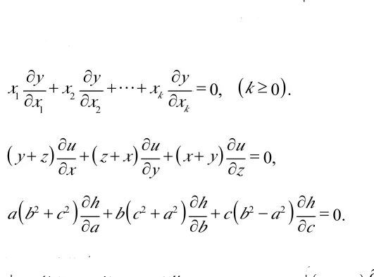
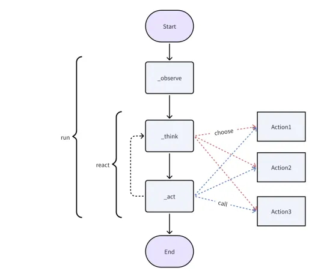

# MiniCPM -O 新模型部署效果记录
## 部署方式
模型：MiniCPM-o 2.6 
显存：GPU 18 G  
platform: Linux/Windows 
推理支持框架：vllm/transformers 
### 环境：
最好参照官方给的 python=3.10,这里用anaconda创建虚拟环境:  
conda create -n minicpmo python==3.10 
git clone https://github.com/OpenBMB/MiniCPM-o.git 
cd MiniCPM-o 
pip install -r requirements_o2.6.txt  
 
建议从魔塔社区下载模型： 
python web_demos/minicpm-o_2.6/model_server.py --model /root/autodl-tmp/model/MiniCPM-o-2_6  

#### 简单测试&部署前端：
如果只是想体验、手动测试，可以用官方提供的前后端demo，这里启动demo： 
python web_demos/minicpm-o_2.6/model_server.py --model /root/autodl-tmp/model/MiniCPM-o-2_6 
之前启动的终端挂着不动，新启动一个终端： 
conda activate minicpmo  
sudo apt-get update  
sudo apt-get install nodejs npm  
npm install -g pnpm  
 
如果出现以下warning，则说明需要安装另一个版本的node.js： 
npm WARN EBADENGINE Unsupported engine { 
npm WARN EBADENGINE   package: 'pnpm@9.15.4', 
npm WARN EBADENGINE   required: { node: '>=18.12' }, 
npm WARN EBADENGINE   current: { node: 'v12.22.9', npm: '8.5.1' } 
npm WARN EBADENGINE } 
 
安装方法： 
MiniCPM官方给出的nodejs配置方式走不通，这里提供一种可行方法，去nodejs官网下载node-v18.20.5-linux-x64.tar.xz，然后执行以下命令： 
1. 使用 tar 命令解压 node-v18.20.5-linux-x64.tar.xz     ；tar -xf node-v18.20.5-linux-x64.tar.xz
2. echo 'export PATH=/usr/local/nodejs/bin:$PATH' >> ~/.bashrc
source ~/.bashrc
最后启动前端： 
cd web_demos/minicpm-o_2.6/web_server 
bash ./make_ssl_cert.sh 

ps:其实上面启动前后端执行的minicpm web server 相关的sh 脚本就一句话启动openssl：  
openssl req -x509 -newkey rsa:2048 -keyout key.pem -out cert.pem -days 365 -nodes

## 部署后，多模态效果记录举例
#### 场景1
>>> 输入：
 
这个图片描述了什么 
输出：
这张图片包含三个数学方程，每个方程涉及偏导数和变量。以下是每个方程的详细描述： 
>>>1. 第一个方程：
[
x_1 \frac{\partial y}{\partial x_1} + x_2 \frac{\partial y}{\partial x_2} + \cdots + x_k \frac{\partial y}{\partial x_k} = 0, \quad (k \geq 0).
]
  ○ 这个方程表示一个关于 (y) 的线性组合的偏导数等于零。(x_i) 是常数，(k) 是非负整数。
>>>2. 第二个方程：
[
\left( y + z \right) \frac{\partial u}{\partial x} + \left( z + x \right) \frac{\partial u}{\partial y} + \left( x + y \right) \frac{\partial u}{\partial z} = 0,
]
  ○ 这个方程是一个关于 (u) 的三元线性偏微分方程，其中各项系数由 (y)、(z) 和 (x) 组成。
>>>3. 第三个方程：
[
a \left( b^2 + c^2 \right) \frac{\partial h}{\partial a} + b \left( c^2 + d^2 \right) \frac{\partial h}{\partial b} + c \left( b^2 - a^2 \right) \frac{\partial h}{\partial c} = 0.
]
  ○ 这个方程是一个关于 (h) 的线性偏微分方程，其中各项系数由 (a)、(b)、(c) 和 (d) 组成。
>>>这些方程可能与偏微分方程或张量分析有关。

#### 场景2
>>> 输入：
 
解释一下这个流程图 
>>>
>>>这张流程图描述了一个决策与执行的过程，从开始到结束。以下是详细的解释：
>>>1. Start：
  ○ 流程从“Start”节点开始。
>>>2. _observe：
  ○ 从“Start”节点出发，流程进入“_observe”阶段。这表示初始的观察或感知阶段。
>>>3. _think：
  ○ 从“_observe”阶段进入“_think”阶段。这是思考或决策阶段，根据观察的信息进行思考。
>>>4. 选择行动：
  ○ 在“_think”阶段，有多个可能的选择路径：
    ■ 选择“Action1”（红色虚线）。
    ■ 选择“Action2”（蓝色虚线）。
    ■ 选择“Action3”（蓝色虚线）。
>>>5. _act：
  ○ 根据在“_think”阶段的选择，流程进入“_act”阶段。这是执行阶段，实际采取行动的地方。
>>>6. 选择路径：
  ○ 从“_act”阶段，继续执行相应的行动：
    ■ 如果选择了“Action1”，流程会返回到“_act”阶段。
    ■ 如果选择了“Action2”，流程会返回到“_act”阶段。
    ■ 如果选择了“Action3”，流程会返回到“_act”阶段。
>>>7. End：
  ○ 最终，流程结束于“End”节点。
这个流程图展示了从观察、思考到执行的循环过程，并通过不同的行动进行反馈。

#### 场景3
>>> 输入：
 
这是两只什么动物？猜测一下这两只动物之间是什么关系 
>>>这张图片展示的是两只小猫。它们看起来非常亲密，可能是一对兄弟姐妹或者是一对母子。 
从它们的姿势和表情来看，这两只小猫之间有一种温馨的关系，可能是父母与子女之间的关系，也可能是兄弟姐妹之间的亲密关系。这种场景通常会让人感到温暖和舒适。