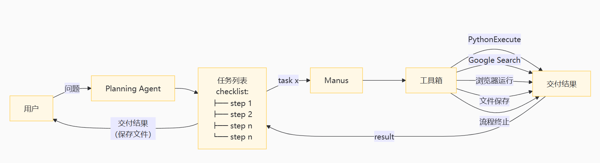

# OpenManus 项目理解

openManus 项目是对 Manus 项目的逆向解析后构建开源的通用Agent框架。主要的执行分为两种：
1. 第一种架构是单智能体。用户只提出问题，Manus通过think 过程，将问题转化为具体步骤，调用工具箱中的各种工具，交付结果。<br>
<br>

2. 第二种是两个智能体之间的交互。一个智能体做计划，输出思维链，另一个智能体也就是manus将计划中的内容全都执行完成。<br>
<br>
<br>

### 项目结构

#### 入口程序：
./main.py （单Agent）， ./run_flow.py （多Agent）<br>
#### 执行单元 与 继承关系
Manus Agent是最终执行任务的主体Agent。<br>
<br>
继承关系：BaseAgent -> ReActAgent -> ToolCallAgent -> manus<br>
Manus 类继承自 ToolChain类，OpenManus/app/agent/manus.py:<br>

```python
class Manus(ToolCallAgent):
    """
    A versatile general-purpose agent that uses planning to solve various tasks.

    This agent extends PlanningAgent with a comprehensive set of tools and capabilities,
    including Python execution, web browsing, file operations, and information retrieval
    to handle a wide range of user requests.
    """
```

ToolChain 类即一些类型的工具集合，负责执行动作，OpenManus/app/agent/toolcall.py：<br>
```python
class ToolCallAgent(ReActAgent):
    """Base agent class for handling tool/function calls with enhanced abstraction"""
```

值得一提的是，OpenManus 算是执行简单工作的Agent中相当精简的实现。<br>
在工作流(需求->think->action计划->执行action->结果输出)中，toolchain的设计以及他主要的成员函数都是按照其父类ReactAgent来设计的，其中包括 think, act, step 三个主要的函数。最后顶层调用的时候，是由BaseAgent调用其 run 成员函数来流式执行实现整个think,act,step的过程的。<br>
最后Agent的输出形式：<br>
```
user: "请帮我查一下北京的天气"
ai:
think: 要获取北京的天气
action: {"name":action_name, "action_args":{"location":"北京"}}
observation: 今天是晴天
ai: 今天是晴天
```
其中 user 是用户输入，think， action 都是think 输出的内容。observation 是act的输出内容。observation会被放入 agent 类的 memory中。

#### 执行单元的prompt举例
OpenManus/app/prompt/manus.py：<br>

```python
SYSTEM_PROMPT = "You are OpenManus, an all-capable AI assistant, aimed at solving any task presented by the user. You have various tools at your disposal that you can call upon to efficiently complete complex requests. Whether it's programming, information retrieval, file processing, or web browsing, you can handle it all."

NEXT_STEP_PROMPT = """You can interact with the computer using PythonExecute, save important content and information files through FileSaver, open browsers with BrowserUseTool, and retrieve information using GoogleSearch.

PythonExecute: Execute Python code to interact with the computer system, data processing, automation tasks, etc.

FileSaver: Save files locally, such as txt, py, html, etc.

BrowserUseTool: Open, browse, and use web browsers.If you open a local HTML file, you must provide the absolute path to the file.

GoogleSearch: Perform web information retrieval

Based on user needs, proactively select the most appropriate tool or combination of tools. For complex tasks, you can break down the problem and use different tools step by step to solve it. After using each tool, clearly explain the execution results and suggest the next steps.
"""
```
从上面可以看到，OpenManus的prompt中，除了有最简单的系统提示之外，还包含了工具的使用提示，限定了工具的使用范围和下一步的动作。<br>
OpenManus/app/prompt/manus.py：<br>

``` python
SYSTEM_PROMPT = "You are an agent that can execute tool calls"

NEXT_STEP_PROMPT = (
    "If you want to stop interaction, use `terminate` tool/function call."
)
```

值得一提的是，prompt不用在实际使用的时候，执行相类似的任务时，不太需要修改；底层使用的大语言模型对整个框架更加重要，底层大语言模型的能力决定每一步是否能够按照prompt约定的格式输出，以及最后的结果。