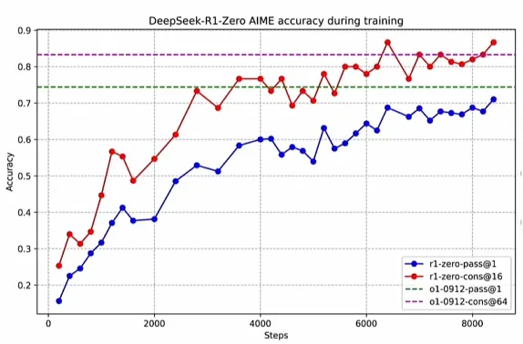
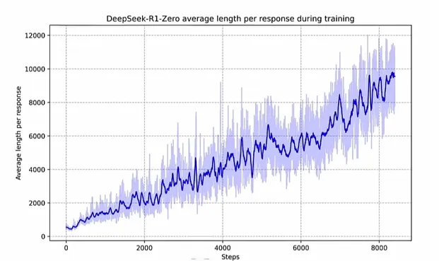
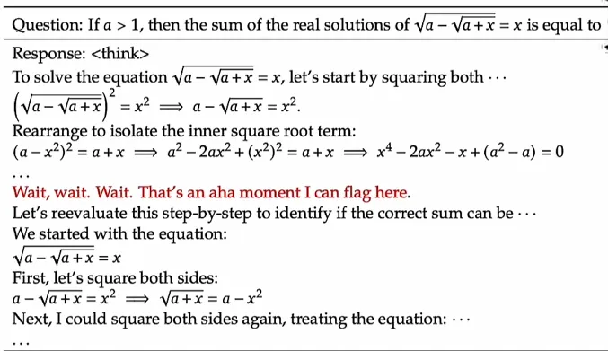
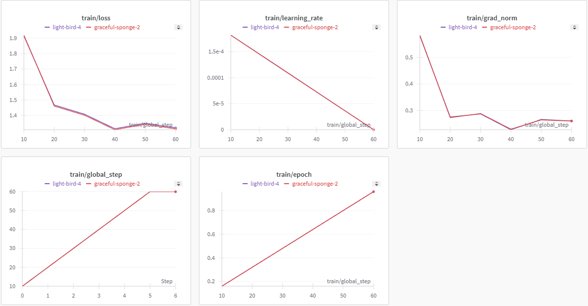

# 深度学习思维链，推导过程 & DeepSeek R1 技术解读
## DeepSeek-R1 技术解读
deepseek 认为之前的上海交大包括一些实验室中沿用的O1的方法是没有必要的（因为可以看到本身OpenAI也没有开源，并且隐藏了o1的推理过程）。<br>
deepseek R1 使用的策略不包含SFT（supervised fine-tuning） ，转而采用大规模强化学习、multi-stage training、强化学习之后接着数据冷启动的方式。<br>
deepseek基于v3 模型训练的框架训练R1，即GRPO(Group Relative Policy Optimization)。几千步强化学习训练之后，模型能力增强显著，在AIME2024集上pass@1 score 15.6%上升到71.0%。值得注意的是，论文中提到，在RL training接近收敛的时候，使用了一些 SFT 数据 给到 RL checkpoint 来重新的post training。<br>
deepseek 的创新点包括：在没有任何 SFT 数据 情况下，将强化学习直接应用到基础模型，没有任何搜索树策略选择问题； 此外，在最后 post training 时，直接使用 长思维链数据（COT）进行一个 SFT； 最后是将deepseek R1 的能力提炼到小模型里面的方式。<br>
### pure RL training 部分
1. 需要注意这个过程包含了两个奖励，Accuracy Award 和 Formate rewards，Formate Rewards是针对 deepseek R1 zero存在的 output formate mixing（即输出语言、模式时常出现混淆的情况）问题加入的。这个是通过强制让大模型输出思考内容的时候必须在'<think>'和'</think>'之间，以此作为formate。<br>
在整个deepseek R1 训练过程中间没有使用针对结果或者过程的奖励模型（processing reward models）。因为在训练过程中发现 “reward hacking”现象，使得模型陷入一个被动的不断推理的过程。
2. deepseek 没有太多的公布这次R1训练的training template 。 但是讲了模型的性能和performance进化的过程。<br>
<br>
3. 提到了模型有一个self revolution 过程，自我进化。网络模型是一开始基于一个预训练大模型进行微调的。表现在开始模型只能做多轮的回答，但是不能做推理，也不会做test time 的一个 reasoning（自我思考，自我推理）。但是在R1的训练过程中，自我思考的时间越来越长。<br>
<br>
4. 整个模型在训练的过程中出现了一个顿悟的时刻，aha的moment.<br>
<br>
上图意为，在推理过程中，模型自己意识到之前的推理不够细致，因此做了一些复盘。<br>
文中也提到了deepseek R1 zero 的可读性比较差，语言混杂。

###  deepseek R1 ： 冷启动 强化学习
首先聚焦于两个问题：1）冷启动时候是否能够加入少量的高质量数据提升模型的性能？ 2）如何提升zero的可阅读性？<br>
第一个问题：R1 相较于 R1 zero 搜集了很多长思维链的数据作为RL的微调过程，一方面也是为了提升可读性。<br>
第二个问题：R1加入了一些奖励，（类似于dpo的效果），这些奖励可能降低模型的性能，但是却能够增加可阅读性。<br>
在拒绝采样和监督微调的情况下，需要很多的tricks：比如R1采用的分阶段微调，在RL一个阶段的训练完成后，就会用这个ckpt断点进行拒绝采样（rejecting sampling）去搜集下一轮的数据。这会生成很多的推理轨迹和相关内容，具体数据量是600K条推理数据。当然这里还要加入很多非推理数据，否则整个模型会变得不会说话。<br>

### 不成功的尝试
1. 在整个deepseek R1 训练过程中间没有使用针对结果或者过程的奖励模型（processing reward models）。因为在训练过程中发现 “reward hacking”现象，使得模型陷入一个被动的不断推理的过程。
2. 很多论文都用 Monte Carlo Tree Search,  这个方法被发现会让模型不断的去探索，模型调起来也很难去做大规模的拓展。因为算法越复杂，越难去做一个scaling out。  只有scale law 才会使我们的模型更好。
类似bert没有gpt1，2，3好的原因，bert encoder decoder 结构越来越复杂，没有只有decoder 的结构方便。

### 训练流程：
接下来是deepseek R1 Zero 的训练方法:<br>
直接从 deepseek v3 经过 GRPO 进化到 R1-Zero。没有使用 SFT微调、蒙特卡洛搜索树。<br>
<br>
deepseek R1 训练流程：<br>
cold-start data (Reasoning Data+ Non-Reasoning data), 得到微调过后的 deepseek V3 模型；<br>
微调 V3 模型  经过 GRPO  得到 DeepSeek R1 中间模型；<br>
用DeepSeek R1 中间模型，rejecting sampling 得到 新的 Reasoning Data。然后专门搜集了一些 Non-Reasoning data .<br>
用新搜集到的 data 再对 V3 模型进行 GRPO 学习。<br>
经过好几轮的迭代之后，得到了比较好的 R1 模型。<br>
此时可以对Qwen 和 LLama 模型进行蒸馏，就得到了网上很多千问和llama相关R1 的一系列蒸馏模型。<br>

### GRPO 解析
RL+LLM : <br>
OnPolicy: 每次训练都基于自己的生成模型（Actor），通过教练（Critic）反馈奖励；效率较高，没有模型自生成，问题是模型训练后可能能力不够；<br>
OffPolicy:基于现有标注的情况进行分析，可能有训练样本与模型不匹配的情况；优势是更可能达到模型能力上限，但是效率低。<br>
PPO示意图（PPO很消耗资源）：<br>
<br>
1. 整个算法运行起来有四个模型在运行：除了Actor Model ，和专家模型 Critic Model 之外还有 Reward Model 和Reference Model。 
2. Critic Model 通常跟 Actor Model  相当大小
3. LLM 通常只有最后一个 token 会被奖励模型打分，训练在每个token上都准确的价值函数难

GRPO 避免了像PPO那样使用额外的 Critic Model(即Value Model) 近似， 而是使用同一问题下多个采样输出的平均奖励作为 基线。<br>
<br>
上面是对比PPO和GRPO的图，如果将PPO中的 Value Model 直接去掉，根据传统的强化学习的经验是无法保证效果的，这个想法相当于直接让Policy Model 对齐Reward Model。 Critic Model 一般是在为了强化学习更加稳定，方差比较少的情况上才加的。现在去掉Critic Model，直接退化成为 Policy Model 是不合理的。为了保证效果能够好，整个算法的关键在于找到一个baseline，使得网络整体在训练的过程中趋于稳定（特别是做过强化学习的都了解，训练是很难保证稳定的，当然这个任务能成功也得益于LLM的泛化性是非常好的的特点）。<br>
解决方案：原先的Critic Model 参与最后的求 Award。 现在没有Critic Model了，直接转变为暴力采样N次，求均值。另外现在变为，Policy Model 去跟 Reference Model 计算 KL 散度。<br>
所以，可见，GRPO 算法没有额外的价值函数，使用的是组内的平均奖励作为基线，使用的组内相对奖励优势函数，这与奖励模型通常在同一问题的不同输出之间进行比较的性质是相符的；  GRPO 直接将训练策略的 πθ 与参考策略的 πref之间计算KL散度，加入到损失函数中，而不是像PPO那样在奖励中添加KL惩罚项。<br>
<br>

## FineTue DeepSeek R1 Llama3 8B distilled model for Medical Reasoning Task
这个是参考网上的医疗问答项目，尝试将 R1 应用在任务上。<br>
这个项目的数据来自这里：https://huggingface.co/datasets/FreedomIntelligence/medical-o1-reasoning-SFT<br>
具体代码见：[./DLReasoningDeepSeekR1/FineTune_DeepSeek_r1_llama3_8B_distilled.py](./DLReasoningDeepSeekR1/FineTune_DeepSeek_r1_llama3_8B_distilled.py)<br>
训练前的 R1 问答：<br>
```
>> 提问：A 61-year-old woman with a long history of involuntary urine loss during activities like coughing or sneezing but no leakage at night undergoes a gynecological exam and Q-tip test. Based on these findings, what would cystometry most likely reveal about her residual volume and detrusor contractions?
一位61岁女性，有在咳嗽或打喷嚏等活动时发生不自主漏尿的长期病史，但夜间没有漏尿，她接受了妇科检查和棉签试验。根据这些检查结果，膀胱测压最有可能揭示她的残余尿量和逼尿肌收缩情况是什么？

>> 回答：<think>
Okay, so I need to figure out what cystometry would show for this 61-year-old woman. Let me start by breaking down the information given.

First, the patient has a long history of involuntary urine loss when she coughs or sneezes. That makes me think of stress urinary incontinence. I remember that stress incontinence is usually due to the bladder not fully emptying, especially when there's increased abdominal pressure, like from coughing.

She doesn't leak at night, though. So that probably rules out something like nocturnal enuresis, which is more common in younger people. Nighttime leakage is often due to the opposite issue, where the bladder contracts too much during sleep.

Now, she underwent a gynecological exam and a Q-tip test. The Q-tip test is used to check for urethral obstruction. If the test is positive, it suggests that the urethra is partially blocked, which can cause difficulty in starting urination and might contribute to urinary retention or incontinence.

In terms of cystometry, which is a diagnostic tool that measures how the bladder behaves when it's filled. It can show things like how much the bladder can hold (residual volume) and how it contracts (detrusor contractions).

So, if she has stress incontinence, her bladder might not empty completely, leading to some residual volume. Also, during cystometry, they might see that her detrusor muscle isn't contracting well during filling, which could contribute to the incomplete emptying.

Wait, but the Q-tip test being positive would indicate obstruction. If there's urethral obstruction, it can cause difficulty in starting urination and might lead to urinary retention, which can overflow and cause incontinence. So, maybe her residual volume is increased because of that.

But I'm a bit confused. Stress incontinence is usually due to the bladder not emptying because of weak detrusor contractions, not obstruction. Obstruction is more about the outflow being blocked, which can lead to retention and overflow incontinence, but maybe in this case, the history is more of stress incontinence.

Hmm, so maybe the cystometry would show increased residual volume if there's some retention, but also poor detrusor contractions, making the bladder capacity lower than normal. Alternatively, if the Q-tip test is positive, suggesting obstruction, maybe the detrusor contractions are normal but the outflow is impaired, leading to retention and overflow.

Wait, but in stress incontinence, the issue is the bladder not emptying because of weak contractions. So, in that case, the residual volume might be normal or slightly increased, and the detrusor contractions would be impaired.

I think I'm getting tangled up here. Let me try to outline the possibilities:

1. If the patient has stress incontinence due to weak detrusor contractions, cystometry would show:
...
- Impaired detrusor contractions (if SUI is present).
- Or normal detrusor contractions but impaired outflow (if obstruction is the main issue).

I'm not entirely sure, but I think the key findings would be increased residual volume and.<｜end▁of▁sentence｜>

好的，我需要弄清楚这位61岁女性的膀胱测压会显示什么。让我先梳理一下给出的信息。
首先，患者在咳嗽或打喷嚏时有长期的不自主漏尿病史。这让我想到了压力性尿失禁。我记得压力性尿失禁通常是由于膀胱没有完全排空，尤其是在腹部压力增加时，比如咳嗽时。
不过，她夜间没有漏尿。所以这大概排除了夜间遗尿的可能性，这种情况在年轻人中更为常见。夜间漏尿通常是由于膀胱在睡眠中收缩过度引起的。
现在，她接受了妇科检查和棉签试验。棉签试验用于检查尿道是否阻塞。如果试验结果为阳性，表明尿道部分堵塞，这可能导致排尿困难，并可能引起尿潴留或尿失禁。
关于膀胱测压，这是一种用于测量膀胱充盈时行为的诊断工具。它可以显示膀胱的容量（残余尿量）以及膀胱如何收缩（逼尿肌收缩）。
所以，如果她患有压力性尿失禁，她的膀胱可能没有完全排空，从而导致一些残余尿量。此外，在膀胱测压过程中，可能会发现她的逼尿肌在充盈时收缩不佳，这可能导致排空不完全。
等等，但如果棉签试验结果为阳性，那就表明存在阻塞。如果有尿道阻塞，可能会导致排尿起始困难，并可能导致尿潴留，进而导致尿液溢出并引起尿失禁。所以，也许她的残余尿量增加是因为这个原因。
但我有点困惑。压力性尿失禁通常是由于膀胱没有排空，因为逼尿肌收缩无力，而不是因为阻塞。阻塞更多是关于尿液流出受阻，这可能导致尿潴留和溢出性尿失禁，但也许在这种情况下，病史更多是压力性尿失禁。
嗯，所以也许膀胱测压会显示残余尿量增加，如果有尿潴留的话，但同时逼尿肌收缩不佳，使膀胱容量低于正常。或者，如果棉签试验结果为阳性，表明存在阻塞，也许逼尿肌收缩正常，但尿液流出受阻，导致尿潴留和溢出。
等等，但在压力性尿失禁中，问题是膀胱没有排空，因为收缩无力。所以，在这种情况下，残余尿量可能正常或略有增加，而逼尿肌收缩可能受损。
我觉得我有点绕进去了。让我试着梳理一下可能性：
如果患者因逼尿肌收缩无力而患有压力性尿失禁，膀胱测压会显示：
……
逼尿肌收缩受损（如果存在压力性尿失禁）。
或者逼尿肌收缩正常但尿液流出受阻（如果阻塞是主要问题）。
我不太确定，但我觉得关键发现可能是残余尿量增加

```



训练后的问答：<br>
```
>> 提问：A 61-year-old woman with a long history of involuntary urine loss during activities like coughing or sneezing but no leakage at night undergoes a gynecological exam and Q-tip test. Based on these findings, what would cystometry most likely reveal about her residual volume and detrusor contractions?
一位61岁女性，有在咳嗽或打喷嚏等活动时发生不自主漏尿的长期病史，但夜间没有漏尿，她接受了妇科检查和棉签试验。根据这些检查结果，膀胱测压最有可能揭示她的残余尿量和逼尿肌收缩情况是什么？

>> 回答：<think>
Okay, so let's think about this. We have a 61-year-old woman who's been dealing with some involuntary urine loss for a while now. That sounds like a urinary incontinence issue. She's been having problems when she coughs or sneezes, which suggests it's a type of stress incontinence. That makes sense because stress incontinence typically happens when you're doing things that put extra pressure on your bladder. 

Now, she went in for a gynecological exam. I'm imagining they probably did a pelvic exam to check for any structural issues. They might have checked her urethra and bladder neck to see if there's any damage or weakness there. 

Then there's the Q-tip test. I remember this test is used to check for urethral function. It's usually done by inserting a catheter into the urethra and then pulling it out gently. If the urethral sphincter is working well, the catheter should come out without much resistance. If it's not, it might come out with some difficulty or even get stuck. 

So, if she passed the Q-tip test, that tells us her urethral sphincter is working properly. It's not obstructed, which means there's no obstruction causing her incontinence. 

Now, considering all this, if she's experiencing stress incontinence, it's more likely due to weak pelvic muscles or weak bladder neck muscles rather than something obstructive. 

When we think about cystometry, it's used to check for how the bladder responds to filling and how it contracts. The findings can tell us if there's any residual volume in the bladder and how the detrusor muscles contract. 

Given that she's dealing with stress incontinence and the Q-tip test passed, cystometry would likely show normal or slightly increased residual volume, but it shouldn't show significant bladder overfilling or hyperreflexia. 

In other words, the cystometry would probably show normal or slightly elevated residual volume, but there wouldn't be any strong evidence of hyperactive detrusor contractions. It's more about weak pelvic muscles causing her symptoms, not an overactive bladder or obstruction. 

So, putting it all together, I think the cystometry results would show her bladder's capacity is normal or slightly increased, and there wouldn't be any significant detrusor contractions that stand out. It's all about the weak pelvic muscles, not the bladder itself.
...

When performing cystometry, it is expected that the test would reveal normal or slightly elevated residual bladder volume. Additionally, there would not be evidence of hyperreflexia or overactive detrusor contractions, as these are typically associated with different types of incontinence, such as urge incontinence or bladder overactivity. 

In summary, cystometry would most likely show that her bladder's residual volume is within normal limits or slightly increased, and there would not be any significant evidence of detrusor contractions that would suggest hyperreflexia or bladder overactivity.<｜end▁of▁sentence｜>
好的，那我们来思考一下。我们有一位61岁的女性，她一直受到一些不自主漏尿的困扰。这听起来像是尿失禁问题。她在咳嗽或打喷嚏时出现问题，这表明可能是压力性尿失禁。这说得通，因为压力性尿失禁通常发生在你做一些对膀胱产生额外压力的事情时。
现在，她去做了妇科检查。我想象他们可能做了盆腔检查，以检查是否有结构问题。他们可能检查了她的尿道和膀胱颈，看看那里是否有损伤或薄弱。
然后是棉签试验。我记得这个试验是用来检查尿道功能的。通常通过将导尿管插入尿道，然后轻轻拉出来进行。如果尿道括约肌工作正常，导尿管应该能够顺利拉出。如果不行，它可能会拉出来有些困难，甚至可能会卡住。
所以，如果她通过了棉签试验，这说明她的尿道括约肌工作正常。没有阻塞，这意味着她的尿失禁不是由阻塞引起的。
综合考虑所有这些情况，如果她患有压力性尿失禁，更有可能是由于盆底肌肉薄弱或膀胱颈肌肉薄弱，而不是由阻塞引起的。
当我们考虑膀胱测压时，它用于检查膀胱对充盈的反应以及膀胱如何收缩。这些发现可以告诉我们膀胱内是否有残余尿量以及逼尿肌如何收缩。
鉴于她患有压力性尿失禁且通过了棉签试验，膀胱测压可能会显示正常或略高的残余尿量，但不应显示膀胱过度充盈或反射亢进。
换句话说，膀胱测压可能会显示正常或略高的残余尿量，但不会有任何强有力的证据表明逼尿肌收缩过度活跃。这更多是关于盆底肌肉薄弱导致她的症状，而不是膀胱过度活跃或阻塞。
所以，综合来看，我认为膀胱测压结果会显示她的膀胱容量正常或略有增加，而且不会有任何显著的逼尿肌收缩突出。这都是关于盆底肌肉薄弱，而不是膀胱本身的问题。
……
进行膀胱测压时，预计该检查会显示膀胱残余量正常或略有增加。此外，不会出现反射亢进或逼尿肌过度活跃的证据，因为这些通常与不同类型的尿失禁有关，例如急迫性尿失禁或膀胱过度活动。
总之，膀胱测压最有可能显示她的膀胱残余量在正常范围内或略有增加，而且不会有任何显著的逼尿肌收缩证据，表明反射亢进或膀胱过度活动。
```