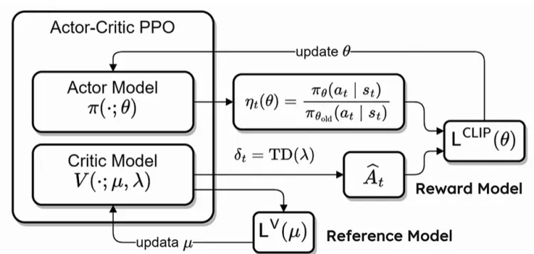
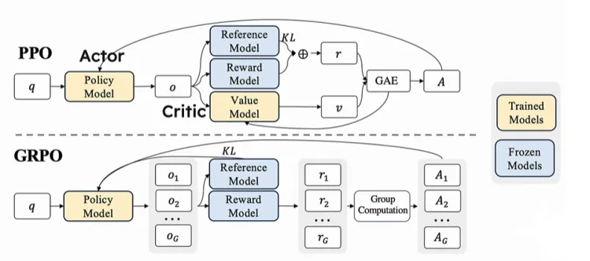

# 深度学习思维链，推导过程 
良好推理的标志是，思维互相构建，以创建新的想法和结论。如果你分享一系列称述，并且其他人能跟得上并得出相同的结论，那么你就建立了一个良好的推理过程。图灵测试也是一系列将世界模型简化后，测试算法是否能做出正确决策的测试；相似的，象棋游戏是更简单的世界模型。 
拿象棋游戏来看算法逻辑推导方式的演进，象棋游戏中人们最开始是将获胜作为目的，着重提高算法“判断当下位置的获胜可能性”和“预测下一个位置的获胜可能性”的能力。 

## PPO & GRPO
### PPO 解析

首先在上图的 Pair good/bad answers 和 Pretrained Model 以及 RW 步骤中训练 reward model r(s,a)，优化正负样本之间的距离： 
L R​ (r ϕ,D)=−E x,y ,y )∼D[logσ(r ​ (x,y w​ )−r ϕ​ (x,y l​ ))]

### GRPO 解析
RL+LLM :  
OnPolicy: 每次训练都基于自己的生成模型（Actor），通过教练（Critic）反馈奖励；效率较高，没有模型自生成，问题是模型训练后可能能力不够； 
OffPolicy:基于现有标注的情况进行分析，可能有训练样本与模型不匹配的情况；优势是更可能达到模型能力上限，但是效率低。 
PPO示意图（PPO很消耗资源）： 
 
1. 整个算法运行起来有四个模型在运行：除了Actor Model ，和专家模型 Critic Model 之外还有 Reward Model 和Reference Model。 
2. Critic Model 通常跟 Actor Model  相当大小
3. LLM 通常只有最后一个 token 会被奖励模型打分，训练在每个token上都准确的价值函数难

GRPO 避免了像PPO那样使用额外的 Critic Model(即Value Model) 近似， 而是使用同一问题下多个采样输出的平均奖励作为 基线。 
 
上面是对比PPO和GRPO的图，如果将PPO中的 Value Model 直接去掉，根据传统的强化学习的经验是无法保证效果的，这个想法相当于直接让Policy Model 对齐Reward Model。 Critic Model 一般是在为了强化学习更加稳定，方差比较少的情况上才加的。现在去掉Critic Model，直接退化成为 Policy Model 是不合理的。为了保证效果能够好，整个算法的关键在于找到一个baseline，使得网络整体在训练的过程中趋于稳定（特别是做过强化学习的都了解，训练是很难保证稳定的，当然这个任务能成功也得益于LLM的泛化性是非常好的的特点）。 
解决方案：原先的Critic Model 参与最后的求 Award。 现在没有Critic Model了，直接转变为暴力采样N次，求均值。另外现在变为，Policy Model 去跟 Reference Model 计算 KL 散度。 
所以，可见，GRPO 算法没有额外的价值函数，使用的是组内的平均奖励作为基线，使用的组内相对奖励优势函数，这与奖励模型通常在同一问题的不同输出之间进行比较的性质是相符的；  GRPO 直接将训练策略的 πθ 与参考策略的 πref之间计算KL散度，加入到损失函数中，而不是像PPO那样在奖励中添加KL惩罚项。 
 