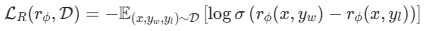

# 深度学习思维链，推导过程 
## 背景&相关历史
良好推理的标志是，思维互相构建，以创建新的想法和结论。如果你分享一系列称述，并且其他人能跟得上并得出相同的结论，那么你就建立了一个良好的推理过程。图灵测试也是一系列将世界模型简化后，测试算法是否能做出正确决策的测试；相似的，象棋游戏是更简单的世界模型。 
拿象棋游戏来看算法逻辑推导方式的演进，象棋游戏中人们最开始是将获胜作为目的，着重提高算法“判断当下位置的获胜可能性”和“预测下一个潜在位置”的能力。 1）最开始是从计算当下棋局，直接模拟3步（或多步）之内的所有下棋的可能来判断下一步该如何走的，但是拿国际象棋来说，每一状态下就有35种左右的可能选择，这样计算几步之内就有天量可能（更不要说围棋每一步都有200种以上的可能性）； 2）上世纪90年代时出现了新的方法，将棋盘格位置作为输入，并输出一个单一的值，自我博弈利用胜负作为反馈来提高效果，经过百万次迭代训练学会了评估国际象棋的位置，算法在国际象棋上达到了人类水平；3） 但是围棋更加复杂，即使只是探索3步之内都存在大量计算。于是到了2014年，通过模仿落子在各个位置的人类行为，计算这些位置的落子概率，研究人员clark和stock.Lee构建了一个新的神经网络，学会了预测人类在当前情况下会下哪一步棋（输出每个棋盘上位置的概率密度分布），但他的表现仍停留在业余水平； 4）解决这个问题的方式是：利用“蒙特卡洛搜索树”和“预测当前位置的胜率的神经网络”的结合，即在树结构回溯路径的时候进行一个当下位置的神经网络预测，回溯朝着最有希望的方向。这个方法比直接计算所有可能性理论上降低准确性，但是节约大把算力（即Alpha go的方法，利用更大的神经网络来预测位置直觉和可能方向，并引导蒙特卡洛树筛选出更加好的方向）； 
 
一些观点认为：对大语言模型的分析可以看出，LLM模型可以模拟几乎所有的世界模型，只要给足上下文。并且，他能够根据任何情况下的建议合理的行动，“Large Language Models are Zero-Shot Reasoners”论文指出，只需要在prompt结尾加上“让我们逐步思考”，就能促使模型开始一系列简单的思考。这些思维链提高了推理任务表现，同时仍然像快速直觉一样，朝着第一个合理的思路前进。 
但是，在这种情况下，如果他沿着一条思路走不通，他可能毅然决然的陷入死胡同，无法找到正确的答案。这催生了一些实验：让大模型不沿着单一思维链走，沿着如思维导图一样的多思维链走，然后使用语言模型自身评估哪些看起来最有前途。这也就是COT的最开始思想，类似于AlphaGo 搜索可能的前进序列\方向的思维过程，而不是单纯把所有的移动\前进过程模拟出来。推理、探索和评估路径，在逻辑种尝试多种办法，最终确定最有希望的一种。 
但要这么做，你需要一个类人类的老师，给予大模型奖励信号，当执行有效步骤出错时，进行惩罚。OPenAI的一篇论文“Let's Verify Step by Step”，指出了一个方法，模型会推理问题，进行一系列思考，并且对每个步骤进行逐步反馈，处理并逐渐发现更好的推理策略。这导致了推理能力大幅提升。从这里开始，推理所需计算量与执行过程中拿的标记数量成比例关系，同时也影响推理准确性。意味着，推理链条更长，比用更大的模型，对结果准确性更有用。 
但是让模型推理链条更长，不是解决更复杂问题的办法，甚至会在特定情况下让他们更弱，更容易原地打转。因此研究人员提出ARC挑战，旨在迫使模型发现新的从未见过的模式，迫使他们进行推理，即从头开始，而不是依赖记忆中的方案。

## 论文：Large Language Can Learn Rules
本文提出了Hypotheses-to-Theories(HtT)框架，通过学习规则库来增强大语言模型(LLMs)的推理能力，“分为规则生成与验证的归纳阶段”和“规则应用的演绎阶段”，在关系推理、数值推理和概念学习任务中显著提高了准确率，并展示了规则的可迁移性。 
下图展示了Hypotheses-to-Theories（HTT）框架在关系推理问题中的应用示例。分为两个阶段：在归纳阶段，模型通过生成和验证规则来学习规则库，使用训练样本来判断规则的正确性。图中展示了几个问题及其答案，标记了正确和错误的规则，正确的规则用绿色标记，错误的规则用红色标记。在演绎阶段，模型利用学习到的规则库来进行推理，以回答测试问题。通过这种方式，HTT框架显著提高了推理的准确性，解决了依赖隐式知识的提示方法在知识错误或不一致时可能产生的错误答案的问题。 
 
本文的主要论点：LLMs在推理任务中表现出色，但依赖隐式知识可能导致错误。需要一种通用方法使LLMs能够从标准数据集中自动发现规则。进而本文提出HtT框架，通过归纳和演绎阶段学习和应用规则库。 
HtT框架意义：
1. 仅仅分解和执行推理步骤不足以解决某些推理问题，因为这些问题需要特定领域的知识来生成正确的步骤。例如，在推断家谱中两个人之间的关系时，LLM需要知道合并家庭关系的基本规则。然而，LLM在生成这些规则时往往容易出错，尤其是在任务偏离传统知识（如非十进制系统的算术）时。因此，解决这一挑战需要找到一种方法，使LLM能够掌握这些领域特定的规则。
2. HtT框架通过两个阶段帮助LLM学习和应用规则：归纳阶段和演绎阶段。在归纳阶段，LLM被要求为训练集中的每个示例生成规则，并通过将LLM的预测与真实答案进行比较来验证规则。然后，根据规则的出现次数和与正确答案的关联频率过滤规则，构建规则库。在演绎阶段，LLM应用学习到的规则来解决推理问题，从而减少生成错误规则的可能性。此外，HtT引入了一种称为从演绎中归纳的技术，将规则生成和验证步骤融合为一个类似演绎的步骤，从而简化了提示工程的工作。
3. 实验中，HtT框架在CLUTRR、Arithmetic和List Functions数据集上验证了其有效性，这些数据集分别对应关系推理、数值推理和概念学习。实验表明，HT在所考虑的模型和数据集上相较于基线提示方法有10-30%的绝对性能提升。此外，学习到的规则可以直接转移到CLUTRR的文本版本中，提供了比以往推理方法更实际的优势。通过消融研究发现，性能提升主要来源于使用学习规则后错误规则数量的减少。同时，实验还观察到在所有三个数据集上，准确率与训练示例数量之间存在对数线性缩放规律。
  

HtT框架结构：
1. HT框架分为归纳阶段和推理阶段，归纳阶段生成和验证规则，推理阶段则从规则库中检索规则以回答测试问题，类似于神经网络的训练和测试阶段。
2. 在归纳阶段，使用LLM生成规则并通过与真实答案的比较进行验证，确保规则的覆盖率和置信度，以构建高质量的规则库。
3. 推理阶段通过将规则库与推理提示结合，指导LLM在需要生成规则时从库中检索，提升推理的准确性和效率。
 

## 论文：基于符号思维链的逻辑推理 SymbCOT
思维链： 
一阶逻辑：

## PPO & GRPO
### PPO 解析

首先在上图的 Pair good/bad answers 和 Pretrained Model 以及 RW 步骤中训练 reward model r(s,a)，优化正负样本之间的距离： 

### GRPO 解析
RL+LLM :  
OnPolicy: 每次训练都基于自己的生成模型（Actor），通过教练（Critic）反馈奖励；效率较高，没有模型自生成，问题是模型训练后可能能力不够； 
OffPolicy:基于现有标注的情况进行分析，可能有训练样本与模型不匹配的情况；优势是更可能达到模型能力上限，但是效率低。 
PPO示意图（PPO很消耗资源）： 
 
1. 整个算法运行起来有四个模型在运行：除了Actor Model ，和专家模型 Critic Model 之外还有 Reward Model 和Reference Model。 
2. Critic Model 通常跟 Actor Model  相当大小
3. LLM 通常只有最后一个 token 会被奖励模型打分，训练在每个token上都准确的价值函数难

GRPO 避免了像PPO那样使用额外的 Critic Model(即Value Model) 近似， 而是使用同一问题下多个采样输出的平均奖励作为 基线。 
 
上面是对比PPO和GRPO的图，如果将PPO中的 Value Model 直接去掉，根据传统的强化学习的经验是无法保证效果的，这个想法相当于直接让Policy Model 对齐Reward Model。 Critic Model 一般是在为了强化学习更加稳定，方差比较少的情况上才加的。现在去掉Critic Model，直接退化成为 Policy Model 是不合理的。为了保证效果能够好，整个算法的关键在于找到一个baseline，使得网络整体在训练的过程中趋于稳定（特别是做过强化学习的都了解，训练是很难保证稳定的，当然这个任务能成功也得益于LLM的泛化性是非常好的的特点）。 
解决方案：原先的Critic Model 参与最后的求 Award。 现在没有Critic Model了，直接转变为暴力采样N次，求均值。另外现在变为，Policy Model 去跟 Reference Model 计算 KL 散度。 
所以，可见，GRPO 算法没有额外的价值函数，使用的是组内的平均奖励作为基线，使用的组内相对奖励优势函数，这与奖励模型通常在同一问题的不同输出之间进行比较的性质是相符的；  GRPO 直接将训练策略的 πθ 与参考策略的 πref之间计算KL散度，加入到损失函数中，而不是像PPO那样在奖励中添加KL惩罚项。 
 