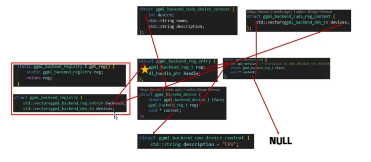
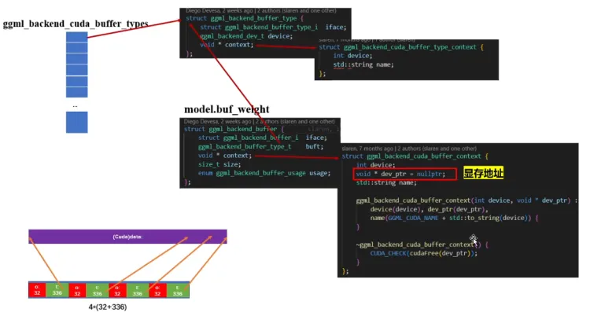
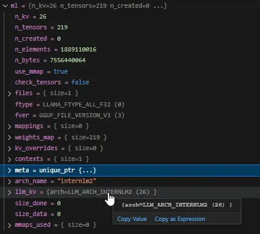
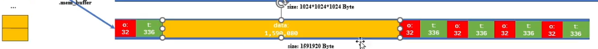
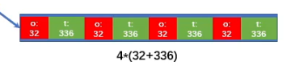
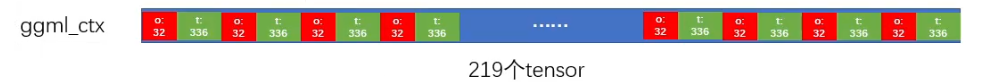
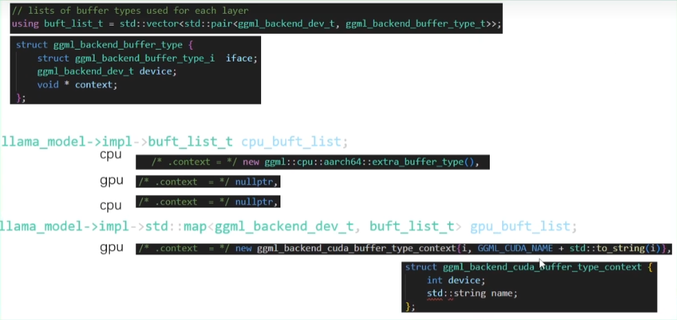

# llama.cpp 简单实践&框架源码解析
llama.cpp 是一个简洁、强大的大语言模型（不止llama，支持多种）部署框架，它基于ggml工程搭建，包含了量化、分布式部署等技术栈。llama.cpp 项目在github上十分活跃，更新速度很快。因此这里采用的学习路径是借用一个直观的例子脚本，即llama.cpp/examples/simple.cpp 来解读源码和说明。这个例子包含了llamacpp部署推理时大部分的主要功能。

## 环境配置
llama.cpp 的环境配置相对来说简单：我拿的是github上的 afa8a9ec9b520137bbd1ca6838cda93ee39baf20 版本；<br>
我默认是使用GPU backend的。切换到ggml目录下的CMakeLists.txt，将其中的第143行：<br>
option(GGML_CUDA                            "ggml: use CUDA"                                  OFF)<br>
改为:<br>
option(GGML_CUDA                            "ggml: use CUDA"                                  ON)<br>

需要使用这个例子还得从huggingface 上下载书生大模型：https://huggingface.co/internlm/internlm2-1_8b/tree/main?library=transformers <br>
为方便，将simple中的main函数中的model路径修改成我们下载的路径：<br>
```cpp
int main(int argc, char ** argv) {
    // path to the model gguf file
    std::string model_path = "<你的model地址目录，如我的是**\AppData\huggingface\hub\models--internlm--internlm2-1_8b\snapshots\e96c608609a487e5674dffb18f7fa135d6c4b171>";
    // ...
```
然后切到根目录用Cmake build即可。<br>
## 源码解读

llama.cpp  simple.cpp 中分为几大步：
1. ggml_backend_load_all（） dll读入所有需要使用的 ggml backend的函数；
2. llama_model_default_params（）返回一个刚初始化的 llama_model_params 类型 参数。其中包含一些超参，比如放到gpu上的layer的总数：n_gpu_layers，在llama模型中，所有219个layer中有99个被放到 gpu中。
3. llama_model_load_from_file  初始化模型得到 模型类对象
4. llama_model_get_vocab 初始化 vocab 表，相当于python代码中的 tokenizer 的部分功能
5. 转换 input 和 prompt 作为输入，并根据初始化的模型类对象调用llama_init_from_model 初始化 模型context 。
6. 利用context 调用模型，并得到输出结果

对上面的步骤择重点来解析：<br>

### llama_model_default_params（）
#### 所返回的 llama_model_params 的参数:
NOTE:llamacpp 中"初始化 context 和 依赖 context 来读取gguf，构建llama_model 的过程"这一部分的结构比较复杂，这里平铺出来可能显得内容多且乱，最好的方法是直接调试，逐步分解，不过在这里还是把个人认为的重点列举出来，供参考，可跳过。<br>
```cpp
struct llama_model_params {
ggml_backend_dev_t * devices; // list 存放设备，因为可能有多张卡，所以需要list
int32_t n_gpu_layers; // 有多少个 layers 放在 gpu 中
enum llama_split_mode split_mode; // 多个 GPU时如何分layer到gpu上，解析见下面“llama_split_mode”
int32_t main_gpu;	// 多gpu时，且用的是分发制时，主分发gpu用的是哪一块
const float * tensor_split;	// 分配给多gpu的比例
llama_progress_callback progress_callback;	// 进度条（不重要）
void * progress_callback_user_data;	//用于计算进度条的内容（不重要）
const struct llama_model_kv_override * kv_overrides;	// model 的kv对，超参

bool vocab_only;    // 这个根据具体实现，这里还不知道不读入 weight 影响什么
bool use_mmap;      // 是否使用内存映射（重要）
bool use_mlock;     // 是否锁页内存
bool check_tensors; // （不重要）
};
```
```cpp 
//llama_split_mode 定义
LLAMA_SPLIT_MODE_NONE  = 0, // 单 GPU
LLAMA_SPLIT_MODE_LAYER = 1, // 将 layers 和 KV cache 在 GPU 之间 分布式部署
LLAMA_SPLIT_MODE_ROW   = 2, // 将 layers 和 KV cache 在 GPU 之间 分布式部署，如果系统支持tensor split，就采用
```
#### llama_model_load_from_file 函数中新建的 llama_model以及 llama_model中的impl类的内容
llama_model_load_from_file 比较重要，其中会新建一个 llama_model 类，参数都是初始化的，tensor赋值和参数赋值会留到之后；但是llama_model 依然包含一些重要的内容： llama_model 中包含了一个 impl 类：
<br>llamacpp是先建立context存放上下文和需要开辟的空间的信息，然后再分配、赋值存储空间的。<br>
先逐步看一下 llama_model中的 impl类的内容（后文再解释内存/显存分配的模式）：
```cpp
// impl 类
struct llama_model::impl {
// ... 
uint64_t n_elements = 0;	
size_t n_bytes = 0;		// 记录总 bytes
std::string desc_str;	// 描述（不重要）

llama_mmaps mappings;	// 内存映射记录, llama_mmaps 见下面

// 这些是强制把他们放到RAM里的方式（锁页内存？）
llama_mlocks mlock_bufs;
llama_mlocks mlock_mmaps;

// ggml_context_ptr 和 ggml_backend_buffer_ptr，后面会拆解
std::vector<ggml_context_ptr> ctxs;	// tensors 的 context，超参（重要类）
std::vector<ggml_backend_buffer_ptr> bufs; // 存放 context中记录的tensor的数据的buffers

buft_list_t cpu_buft_list;	// 当cpu backends 时，这个类被使用
// gpu backends 时，记录gpu的list，多个gpu的每一个devices，对应一个buffer list
std::map<ggml_backend_dev_t, buft_list_t> gpu_buft_list; 

// 记录每个layers的devies 和 buffers列表
// 关于这个layer_dev中牵涉到的各种类，包括 ggml_backend_dev_t
// 是一个复杂的相互引用，见后文详细分解
struct layer_dev {		
ggml_backend_dev_t dev;		
buft_list_t * buft_list;
};

layer_dev dev_input = {};	// 记录 input 和 output 的层单独复制一遍
layer_dev dev_output = {};
std::vector<layer_dev> dev_layer;
};
```

#### impl类中的ggml_context_ptr 
ggml_context_ptr 结构体:
```cpp
// 本质上是一个链表新，begin 和 end都是 ggml_object
struct ggml_context {
size_t mem_size;
void * mem_buffer;		//存这些 object 的 buffer指针
bool   mem_buffer_owned;// 这些 buffer是否是这个device所owned，如果是则要负责释放这些buf
bool   no_alloc;

int    n_objects;

struct ggml_object * objects_begin;
struct ggml_object * objects_end;
};
```
ggml_context_ptr 中的 ggml_object:
```cpp
struct ggml_object {
size_t offs;
size_t size;

struct ggml_object * next;

enum ggml_object_type type;  //三类：GGML_OBJECT_TYPE_TENSOR,GGML_OBJECT_TYPE_GRAPH,GGML_OBJECT_TYPE_WORK_BUFFER

char padding[4];
};
```
#### impl类中的ggml_backend_buffer_ptr相关内容
顺着impl 类的成员 ggml_backend_buffer_ptr 会找到ggml_backend_buffer 结构体。<br>
ggml_backend_buffer 结构体:
```cpp
struct ggml_backend_buffer {
struct ggml_backend_buffer_i  iface;// 这个结构里存放的都是 interface 接口的函数指针
// buft里面包含一个ggml_backend_buffer_type_i 的interface和 一个 ggml_backend_reg_t
ggml_backend_buffer_type_t    buft;
void * context;	 	// 这里注意多态，只有cpu backend和gpu backend的context不一样
size_t size;
enum ggml_backend_buffer_usage usage;
};
```

<br>
这些 ggml_backend 和  registry 相关的东西都有相互之间的引用。这里借用图来分解一下llamacpp中复杂的ggml backend 相互引用关系：<br>
<br>

```cpp 
struct ggml_backend_reg_i {
const char * (*get_name)(ggml_backend_reg_t reg);
//调用函数，获得 device数目和具体device信息
size_t             (*get_device_count)(ggml_backend_reg_t reg);
ggml_backend_dev_t (*get_device)(ggml_backend_reg_t reg, size_t index);
// 维护一个来自backend函数指针
void * (*get_proc_address)(ggml_backend_reg_t reg, const char * name);
};
```

void ggml_backend_load_all_from_path(const char * dir_path)   中会调用：<br>
- ggml_backend_load_best("blas", silent, dir_path);<br>
    - ggml_backend_load_best("cann", silent, dir_path);<br>
    ggml_backend_load_best("cuda", silent, dir_path);<br>
        - get_reg().load_backend(path, silent);	<br>
<br>

get_reg() 获取的是 register ，其中调用：<br>
```cpp
static ggml_backend_registry & get_reg() {
    static ggml_backend_registry reg;
    return reg;
}
```
创建 ggml_backend_registry 全局对象，在构建该对象时：<br>
```cpp
struct ggml_backend_registry {
std::vector<ggml_backend_reg_entry> backends;
std::vector<ggml_backend_dev_t> devices;
```
会创建这两个，这里device 在cpubackends的时候是一对一的，但是在用gpu时，devices不与backends一一对应，因为可能多个devices。（在用gpu时，应该是两个backends分别代表 cpu资源和gpu卡，多张卡就是多个devices）。<br>
<br>
前面的很多buffer 可以之后说，注意在private 中有需要私有的实现，比如：<br>
std::unique_ptr<impl> pimpl;    其中 impl中有上文提到的 ggml_context_ptr， 还有  ggml_backend_buffer_ptr，
这里的buffer分cpu的buffer，和使用cuda时的buffer. 我们先聚焦于cuda backend的buffer结构:<br>
<br>
值得注意的是，最后llama_model param里计算出的总字节数大小，是遍历ctx也就是context 里的总字节数存下来，
ctx->size += GGML_PAD(ggml_nbytes(&ti.t), ctx->alignment);<br>
<br>
关于 ggml.c 中的  内存对齐这个问题后面再讨论：const size_t mem_size = params.mem_buffer ? params.mem_size : GGML_PAD(params.mem_size, GGML_MEM_ALIGN);<br>
<br>


### llama_model_load_from_file()
llama_model_load_from_file会调用 llama_model_load，其中会创建 llama_model_loader 类：const int status = llama_model_load(path_model, splits, *model, params);<br>
```cpp
try{
    llama_model_loader ml(fname, params.use_mmap, params.check_tensors, params.kv_overrides);
    // ...

    try {
            model.load_hparams(ml);   // 这个 load_hparams 的最后一句是 
            //hparams.rope_type = llama_model_rope_type(this); 是用来设置旋转位置编码的
    try {	// 获取分词词表
            model.load_vocab(ml);   
            // load_vocab 中 有调用 impl 的load，将tokenize的类型 等从 ml中load进来，然后初始化
            // 题外话：llama 用的 tokenizer 是 SPM， 同BPE一样
            // 这个load 中包括添加起始和结束的 字符 ：
            // if (ml.get_key(LLM_KV_TOKENIZER_ADD_BOS, temp, false)) {add_bos = temp;}
            // if (ml.get_key(LLM_KV_TOKENIZER_ADD_EOS, temp, false)) {add_eos = temp;}
            // 和特殊字符：
                //if (special_eot_id == LLAMA_TOKEN_NULL) {
                //if (false
                //        || t.first == "<|eot_id|>"
                //        || t.first == "<|im_end|>"
                //        || t.first == "<|end|>"
                //        || t.first == "<end_of_turn>"
                //        || t.first == "<|endoftext|>"
                //        || t.first == "<EOT>"
                //        || t.first == "<｜end▁of▁sentence｜>" // DeepSeek
                //   ) {
        // ...
    // 然后开始 load_tensor, 这个是重点。 这里ml已经快要销毁了，因此context这里会将权重加载到
    // gpu 里了， 加载到 model 里面（llama_model 类的对象）
    // 我们单独来讲这个函数
        if (!model.load_tensors(ml)) {
            // ...
        }
        // ...
```
首先说调用完成之后ml中会有哪些成员:(mappings 当下刚初始化，还什么都没用，所以size是0，weights_map 是键值对，里面是每个层 的名字，contexts 是链表ggml_obj+tensors头的图，meta是存gguf的context)<br>
<br>

#### llama_model_loader 类
源码：llama_model_loader 和 他的构造函数

```cpp
struct llama_model_loader{
// ... 
std::vector<ggml_context_ptr> contexts;
// ...

llama_model_loader::llama_model_loader(
const std::string & fname,
std::vector<std::string> & splits,
bool use_mmap,
bool check_tensors,
const struct llama_model_kv_override * param_overrides_p) {
    // ...

    struct ggml_context * ctx = NULL;
    struct gguf_init_params params = {
    /*.no_alloc = */ true,
    /*.ctx      = */ &ctx,
};
    meta.reset(gguf_init_from_file(fname.c_str(), params)); //gguf 的部分被存放到meta中

    // ...

    files.emplace_back(new llama_file(fname.c_str(), "rb")); 
    // ggml 的ctx 被存放到 contexts里
    contexts.emplace_back(ctx);     // 注意这里其实将所构建的ctx加到了contexts的结尾
    // emplace_back可以传入参数在结尾构建一个， push_back只在结尾添加一个已经构建好的对象

    // ... 下面是一些打印 kv 对信息的操作，和内部统计赋值简单操作，略过

    this->use_mmap = use_mmap;		// 最后设置“是否使用内存映射”
    this->check_tensors = check_tensors;		// 是否检查 tensors
}
```
其中gguf_init_from_file 调用 gguf_init_from_file_impl 函数：<br>
```cpp
struct gguf_context * gguf_init_from_file_impl(FILE * file, struct gguf_init_params params) {
    const struct gguf_reader gr(file);
    struct gguf_context * ctx = new gguf_context;
    // ...

    // header
    int64_t n_kv      = 0;
    int64_t n_tensors = 0;
    if (ok && gr.read(ctx->version)) {	// 从 gguf 文件读入 version
        // ....
    }
    // ...
    if (ok && gr.read(n_tensors)) {	// 从 gguf 读 n_tensors，例子中是219个
        // ...
    }
    // ...
    if (ok && gr.read(n_kv)) {  // 从 gguf 读 n_kv 键值对，例子中是26个
        // ...
    }

    //...
    // KV pairs
    {
        for (int64_t i = 0; ok && i < n_kv; ++i) {
            std::string key;
            gguf_type   type     = gguf_type(-1);
            bool        is_array = false;
            uint64_t    n        = 1;
            // ...
            // ?: 这里不知道是在检查什么
            for (size_t j = 0; ok && j < ctx->kv.size(); ++j) {
                if (key == ctx->kv[j].key) {
                    fprintf(stderr, "%s: duplicate key '%s' for tensors %zu and %" PRIi64 " \n", __func__, key.c_str(), j, i);
                    ok = false;
                }
            }
            // ...
            // 把键值对读入，总共26个，循环中每次读一个
            switch (type) {
                case GGUF_TYPE_UINT8:   ok = ok && gguf_read_emplace_helper<uint8_t>    (gr, ctx->kv, key, is_array, n); break;
                case GGUF_TYPE_INT8:    ok = ok && gguf_read_emplace_helper<int8_t>     (gr, ctx->kv, key, is_array, n); break;
                //...
            }
        }
    }
    // read the tensor info 这里要读取 tensor 的 info 了
    for (int64_t i = 0; ok && i < n_tensors; ++i) {
        struct gguf_tensor_info info;
        // ...
        ggml_set_name(&info.t, name.c_str());  // 把名字付给 tensor
        // ...
    }
    // tensor shape
    {
        uint32_t n_dims = -1;
        ok = ok && gr.read(n_dims);
        // ...
    }
    // ...
    // 到这里 tensor 的名字和维度还有类型已经读取完了 

    // ...
    // compute the total size of the data section, taking into account the alignment
    // 这里作了一个操作：将所有的Pad过后的align好的 tensor 的字节 累加，记录到 ctx中
    {
        ctx->size = 0;
        for (size_t i = 0; i < ctx->info.size(); ++i) {
            const gguf_tensor_info & ti = ctx->info[i];
            if (ti.offset != ctx->size) {
                fprintf(stderr, "%s: tensor '%s' has offset %" PRIu64 ", expected %zu\n",
                    __func__, ti.t.name, ti.offset, ctx->size);
                fprintf(stderr, "%s: failed to read tensor data\n", __func__);
                gguf_free(ctx);
                return nullptr;
            }
            ctx->size += GGML_PAD(ggml_nbytes(&ti.t), ctx->alignment);
        }
    }
    // 只有有需要时，才load tensor data
    if (params.ctx != nullptr) {
        // gguf_context 里面指明了是 no_alloc 时,只创建 "empty" tensors 不 read binary blob。否则 load 进 binary blob 到 ggml_context 之后 将  ggml_tensor 结构体与 binary blob 中的相应位置联系起来指明
        const size_t mem_size =
            params.no_alloc ?
            (n_tensors    )*ggml_tensor_overhead() :
            (n_tensors + 1)*ggml_tensor_overhead() + ctx->size;
        // 这里对应两种方式，第一种是backend只存多个object+tensor头
        //（图见下面章节“gpubackend 和 cpu 模式下的tensor 内存分配情况”）
        // 第二种是cpu形式，存一个object+tensor头和weight data，以及多个 object+tensor头
        // （图见下面章节“gpubackend 和 cpu 模式下的tensor 内存分配情况”https://www.yuque.com/huangyuxiang-8hx5j/wb31rp/lv9gnrqmoz2yyp07#bJo3x）

        struct ggml_init_params pdata = {
            /*mem_size   =*/ mem_size,
            /*mem_buffer =*/ nullptr,
            /*no_alloc   =*/ params.no_alloc,
        };
        // 注意这里 ggml_init 逻辑与ggml项目中的一样，
        // 但是这里llamacpp工程中不同点是其中没有创建 g_state 这个全局变量了
        *params.ctx = ggml_init(pdata);
        // 到这里是把 context 创建完
        // ...
        // 下面要把tensor 都放进去 
        // 我们只考虑 gpu backend 的场景：
        ggml_set_no_alloc(ctx_data, true); // 由于gpu backend，所以no_alloc 为True

        // create the tensors
        for (size_t i = 0; i < ctx->info.size(); ++i) {
            const struct gguf_tensor_info & info = ctx->info[i];
            // 这里要把刚刚创建的 context 传进去，来创建这个 tensor
            struct ggml_tensor * cur = ggml_new_tensor(ctx_data, info.t.type, GGML_MAX_DIMS, info.t.ne);
            // ...
        }
        // 可以想到，执行219遍创建tensor,连接入context，
        // 下面章节“gpubackend 和 cpu 模式下的tensor 内存分配情况”中那个219长度的链表就创建出来了
```
其中初始化的 gguf_context 是这样的（其中包含kv）：<br>
```cpp
struct gguf_context {
uint32_t version = GGUF_VERSION;

std::vector<struct gguf_kv> kv;
std::vector<struct gguf_tensor_info> info;

size_t alignment = GGUF_DEFAULT_ALIGNMENT;
size_t offset    = 0; // offset of `data` from beginning of file
size_t size      = 0; // size of `data` in bytes

void * data = nullptr;
};

// 其中 gguf_kv 的定义是这样的
struct gguf_kv {
std::string key;

bool is_array;
enum gguf_type type;	// 这个定义了下面这个 data 是以什么形式解读的
// 比如例子中 是GGUF_TYPE_INT32（4） 
// 意思是 data中虽然存了4个 int8类型，但是要按 int32来解析
std::vector<int8_t>      data;
std::vector<std::string> data_string;
// ...

}
```
读取 tensor info 时的 gguf_tensor_info 结构是这样的：<br>
gguf_tensor_info <br>
```cpp
struct gguf_tensor_info {
struct ggml_tensor t; // for holding the equivalent info
uint64_t offset;      // offset from start of `data`, must be a multiple of `ALIGNMENT`
};
```
#### gpubackend 和 cpu 模式下的tensor 内存分配情况
这里还是要分清一下cpu backend 和 gpu backend 情况下的 内存/显存分配方式的不同:<br>
cpu only：比gpu模式，多放一个头+data<br>
<br>
gpubackend：<br>
<br>
读完219 个tensor放在context里面的时候（链表）：<br>
<br>

#### load_hparams & load_vocab 函数
llama_model_loader 创建完成之后会调用 load_hparams，这个函数会将ml中的kv对 读到 hparams 中,之后是 load_vocab 函数<br>

#### load_tensors 函数
load_hparams 之后会调用 load_tensors 函数。十分重要，单独分析:<br>
llama_model_load 中的 load_tensors 函数 ， 用来将ml 中的 context 中的内容读到 llama_model 和 gpu中<br>
有关cpu gpu 的 buf list,我看过一些博文，cpu部分的buflist 确实会创建3个，第一个是cpu的dev，第二个是gpu的dev，第三个又是cpu的dev，不清楚这样的设计是为了规避什么，但是这里执行时在有gpu的情况下，会不用第一个cpu的dev的buflist。:<br>
<br>
源码：<br>
load_tensors 函数：<br>

```cpp
// 这里注意，我把 llama_model 的成员 impl 的结构放出来， 这里有个cpu_buft_list， 还有
// 一个map类型的 gpu_buft_list
struct llama_model::impl {
    impl() {}
    ~impl() {}
    // ...
    buft_list_t cpu_buft_list;
    // 这是因为 cpu只有一个，但是gpu可能有多个，因此需要用map记录分配
    std::map<ggml_backend_dev_t, buft_list_t> gpu_buft_list; 
    // 从这里也能看出，layer_dev 中，因为可能layer是放在不同device gpu上的，
    // 因此这里也带了一个 ggml_backend_dev_t 用于记录需要放到的device
    struct layer_dev {
        ggml_backend_dev_t dev;
        buft_list_t * buft_list;
    };
    // ...
}

bool llama_model::load_tensors(llama_model_loader & ml) {
    const auto & split_mode   = params.split_mode;
    const auto & n_gpu_layers = params.n_gpu_layers;
    const auto & use_mlock    = params.use_mlock;
    const auto & tensor_split = params.tensor_split;

    const int n_layer = hparams.n_layer;	//用于ROPE 旋转位置编码

    const bool use_mmap_buffer = true;      // 是否使用内存映射
    
    // build a list of buffer types for the CPU and GPU devices
    pimpl->cpu_buft_list = make_cpu_buft_list(devices);
    for (auto * dev : devices) {
        buft_list_t buft_list = make_gpu_buft_list(dev, split_mode, tensor_split);
        // 将cpu_buft_list 作为备用先加入进来，然后在加入当下的gpu buf_list
        // 注意这里，每一个gpu devices都有一个buf list 加入
        buft_list.insert(buft_list.end(), pimpl->cpu_buft_list.begin(), pimpl->cpu_buft_list.end());
        pimpl->gpu_buft_list.emplace(dev, std::move(buft_list));
    }

    // ...
    // 得到每个device 的显存量
    bool all_zero = tensor_split == nullptr || std::all_of(tensor_split, tensor_split + n_devices(), [](float x) { return x == 0.0f; });
    std::vector<float> splits(n_devices());
    if (all_zero) {
        // default split, by free memory
        for (size_t i = 0; i < n_devices(); ++i) {
            ggml_backend_dev_t dev = devices[i];
            size_t total;
            size_t free;
            ggml_backend_dev_memory(dev, &free, &total);
            splits[i] = free;
        }
    } else {
        std::copy(tensor_split, tensor_split + n_devices(), splits.begin());
    }
    // 计算每个devices 分配的split 比例
    float split_sum = 0.0f;
    for (size_t i = 0; i < n_devices(); ++i) {
        split_sum += splits[i];
        splits[i] = split_sum;
    }
    for (size_t i = 0; i < n_devices(); ++i) {
        splits[i] /= split_sum;
    }
    // ... 
    ggml_backend_dev_t cpu_dev = ggml_backend_dev_by_type(GGML_BACKEND_DEVICE_TYPE_CPU);
    const int i_gpu_start = std::max((int) hparams.n_layer - n_gpu_layers, (int) 0);
    const int act_gpu_layers = devices.empty() ? 0 : std::min(n_gpu_layers, (int)n_layer + 1);
    auto get_layer_buft_list = [&](int il) -> llama_model::impl::layer_dev {
        // i_gpu_start 是刚计算出来的gpu部署layer的起点，如果早于这个起点
        // 则会被放到 cpu buf list 中
        if (il < i_gpu_start || (il - i_gpu_start) >= act_gpu_layers) {
            return {cpu_dev, &pimpl->cpu_buft_list};
        }
        const int layer_gpu = std::upper_bound(splits.begin(), splits.begin() + n_devices(), float(il - i_gpu_start)/act_gpu_layers) - splits.begin();
        auto * dev = devices.at(layer_gpu);
        return {dev, &pimpl->gpu_buft_list.at(dev)};
    };

    // 将初始的input放到 cpu上，这样有一定的好处，可以使得效率更高，没必要input也传到gpu上
    pimpl->dev_input = { cpu_dev, &pimpl->cpu_buft_list };
    // 其余的用于ROPE 旋转位置编码的layer 和 output layer 都放到 gpu上，用的是lambda函数 get_layer_buft_list
    // ...
    // 然后先定义 buffer 的 context，用下面这个lambda 函数定义
    std::map<ggml_backend_buffer_type_t, ggml_context *> ctx_map;
    auto ctx_for_buft = [&](ggml_backend_buffer_type_t buft) -> ggml_context * {
        auto it = ctx_map.find(buft);
        if (it == ctx_map.end()) {
            ggml_init_params params = {
                /*.mem_size   =*/ ctx_size,
                /*.mem_buffer =*/ NULL,
                /*.no_alloc   =*/ true,
            };

            ggml_context * ctx = ggml_init(params);
            if (!ctx) {
                throw std::runtime_error(format("failed to create ggml context"));
            }

            ctx_map[buft] = ctx;
            pimpl->ctxs.emplace_back(ctx);

            return ctx;
        }
        return it->second;
    };

    //  ... 
    // 初始化 tensor , 这个函数比较重要, 因为如果需要定制自己的模型用于llamacpp，只需要
    // 定制特殊的层就行，然后加入到create_tensor 能初始化的层类型中
    auto create_tensor = [&](const LLM_TN_IMPL & tn, const std::initializer_list<int64_t> & ne, int flags) -> ggml_tensor * {
            ggml_tensor * t_meta = ml.get_tensor_meta(tn.str().c_str());
        // ...

        // select_weight_buft 调用weight_buft_supported 逐个验证、选取buft_list 中的buf来用
        ggml_backend_buffer_type_t buft = select_weight_buft(hparams, t_meta, op, *buft_list);
        // 这里避免使用的buf是host device中的buf（原因？？？）
        auto * buft_dev = ggml_backend_buft_get_device(buft);
        if (ml.use_mmap && buft_dev && buft == ggml_backend_dev_host_buffer_type(buft_dev)) {
            auto * cpu_dev = ggml_backend_dev_by_type(GGML_BACKEND_DEVICE_TYPE_CPU);
            buft = ggml_backend_dev_buffer_type(cpu_dev);
        }
        // ...
        // if duplicated, check if the original tensor was allocated in the same
        // buffer type context and avoid creating a new one
            if (flags & TENSOR_DUPLICATED) {
                ggml_tensor * t = ggml_get_tensor(ctx, tn.str().c_str());
                if (t) {
                    return t;
                }
            }
        // ！！！关键函数，根据传入参数tn，和维度信息ne，构建tensor放在 ctx中
        // 其中调用了ml的成员函数 check_tensor_dims 和 ggml_dup_tensor 函数
        return ml.create_tensor(ctx, tn, ne, flags);
        
    // 然后是完整的读入层的代码
    // ...
    case LLM_ARCH_INTERNLM2:
                {
                    tok_embd = create_tensor(tn(LLM_TENSOR_TOKEN_EMBD, "weight"), {n_embd, n_vocab}, 0);

                    // output
                    output_norm = create_tensor(tn(LLM_TENSOR_OUTPUT_NORM, "weight"), {n_embd}, 0);
                    output      = create_tensor(tn(LLM_TENSOR_OUTPUT,      "weight"), {n_embd, n_vocab}, 0);
                    // 循环读入
                    for (int i = 0; i < n_layer; ++i) {
                        auto & layer = layers[i];

                        layer.attn_norm = create_tensor(tn(LLM_TENSOR_ATTN_NORM, "weight", i), {n_embd}, 0);
                        // layer.wqkv = create_tensor(tn(LLM_TENSOR_ATTN_QKV, "weight", i), {n_embd, n_embd + 2*n_embd_gqa}, 0);
                        layer.wq = create_tensor(tn(LLM_TENSOR_ATTN_Q,   "weight", i), {n_embd, n_embd}, 0);
                        layer.wk = create_tensor(tn(LLM_TENSOR_ATTN_K,   "weight", i), {n_embd, n_embd_gqa}, 0);
                        layer.wv = create_tensor(tn(LLM_TENSOR_ATTN_V,   "weight", i), {n_embd, n_embd_gqa}, 0);

                        layer.wo = create_tensor(tn(LLM_TENSOR_ATTN_OUT, "weight", i), {n_embd, n_embd}, 0);
                        layer.ffn_norm = create_tensor(tn(LLM_TENSOR_FFN_NORM, "weight", i), {n_embd}, 0);
                        layer.ffn_gate = create_tensor(tn(LLM_TENSOR_FFN_GATE, "weight", i), {n_embd,   n_ff}, 0);
                        layer.ffn_down = create_tensor(tn(LLM_TENSOR_FFN_DOWN, "weight", i), {  n_ff, n_embd}, 0);
                        layer.ffn_up   = create_tensor(tn(LLM_TENSOR_FFN_UP,   "weight", i), {n_embd,   n_ff}, 0);
                    }
                } break;
```
load_tensors()中的 make_cpu_buft_list,没有ACCEL 处理器，因此只会添加一个cpu：<br>
```cpp
static buft_list_t make_cpu_buft_list(const std::vector<ggml_backend_dev_t> & devices) {
    buft_list_t buft_list;
    // ... ACCEL 处理器部分，跳过
    // 拿到的 cpu_dev 和 cpu_reg 对应就是之前提到过的 <ggml_backend_dev_t> 和 <ggml_backend_reg_entry>类型
    auto * cpu_dev = ggml_backend_dev_by_type(GGML_BACKEND_DEVICE_TYPE_CPU);
    auto * cpu_reg = ggml_backend_dev_backend_reg(cpu_dev);
    // ...
    // 添加一个主机缓冲区类型，用于在主机缓冲区中存储张量，这在将大量批次的处理任务卸载到GPU设备时非常有用，因为它减少了通常用于数据传输的时间。通常使用设备列表中的第一个设备来完成。一个更好的方法是按权重处理，使用设备的offload_op函数来确定它是否从存储在主机缓冲区中受益。
    for (auto * dev : devices) {
        ggml_backend_buffer_type_t buft = ggml_backend_dev_host_buffer_type(dev);
        if (buft) {
            buft_list.emplace_back(dev, buft);
            break;
        }
    }
```
gpu的buflist 生成里面调用了 ggml_backend_cuda_buffer_type,  效果同ggml_backend_dev_backend_reg<br>
```cpp
ggml_backend_buffer_type_t ggml_backend_cuda_buffer_type(int device) {
    //... 
    if (!ggml_backend_cuda_buffer_type_initialized) {
        for (int i = 0; i < ggml_backend_cuda_get_device_count(); i++) {
            ggml_backend_cuda_buffer_types[i] = {
                /* .iface    = */ ggml_backend_cuda_buffer_type_interface,
                /* .device   = */ ggml_backend_reg_dev_get(ggml_backend_cuda_reg(), i),
                /* .context  = */ new ggml_backend_cuda_buffer_type_context{i, GGML_CUDA_NAME + std::to_string(i)},
                };
        }
        ggml_backend_cuda_buffer_type_initialized = true;
    }

    return &ggml_backend_cuda_buffer_types[device];
    // ...
```
ggml_backend_cuda_device_get_memory  最底层是根据ctx  的信息调用 cudaMemInfo 设备接口获得的<br>
最后创建tensor之前有一个繁琐的验证过程 select_weight_buft，这里只简单介绍，他的结果是通过构建ggml_object 返回合理的buf。<br>

#### ml.create_tensors步骤
load_tensor  中 create_tensor 最后调用的 ml.create_tensors 函数中有使用的check_tensor_dims 作用是检查所需生成的tensor的维度信息, 其中底层调的是未分配buffer的ctx 的 get_weight 函数，然后检查这些函数的维度是否合格。检查完维度后就是最关键的根据传入信息创建tensors 即调用ggml_dup_tensor，然后记录下ggml_nbytes总共要占用多少空间。<br>
应当说明，在load_tensor 执行完成之后还是没有构建出计算图也没有分配buffer空间，中间构建的图，都释放了，只是用来验证这个操作在device上分配buffer是否能够支持。<br>
当load_tensor 都执行完的时候，llama_model 里面的各个layer的属性就都从文件信息中拿到了<br>
ggml_new_tensor_impl(调用完这个之后也只是将存放在 host机器里面的ggml_tensor信息全部初始化完了，并返回给 select_weight_buft)：<br>
```cpp
static struct ggml_tensor * ggml_new_tensor_impl(
struct ggml_context * ctx,
enum   ggml_type      type,
int                   n_dims,
const int64_t       * ne,
struct ggml_tensor  * view_src,
size_t                view_offs) {
    
    GGML_ASSERT(type >= 0 && type < GGML_TYPE_COUNT);
    GGML_ASSERT(n_dims >= 1 && n_dims <= GGML_MAX_DIMS);
    // ...
    // 因为根据数据类型的不同，可能一行存储的数据个数是不同的（如INT8的数据4个才能占用INT32的空间）
    // 所以需要重新计算一行有多少个元素，但是只需要对ne的第一个维度计算
    size_t data_size = ggml_row_size(type, ne[0]);  
    // 然后算整个tensor的大小
    for (int i = 1; i < n_dims; i++) {
        data_size *= ne[i];
    }

    size_t obj_alloc_size = 0;
    // 当context设置了 no_alloc 的时候是不会在cpu context's memory pool中申请buf的
    if (view_src == NULL && !ctx->no_alloc) {
        obj_alloc_size = data_size;
    }

    struct ggml_object * const obj_new = ggml_new_object(ctx, GGML_OBJECT_TYPE_TENSOR, GGML_TENSOR_SIZE + obj_alloc_size);
    GGML_ASSERT(obj_new);
    // 直接重定向为 ggml_tensor *，内存地址就是 在ctx的内存mem_buffer 上 加上obj_new->offs偏移量 
    
    struct ggml_tensor * const result = (struct ggml_tensor *)((char *)ctx->mem_buffer + obj_new->offs);

    // 初始化 需要返回的 ggml_tensor 然后进行
    *result = (struct ggml_tensor) {
        /*.type         =*/ type,
        /*.buffer       =*/ NULL,
        /*.ne           =*/ { 1, 1, 1, 1 },
        /*.nb           =*/ { 0, 0, 0, 0 },
        /*.op           =*/ GGML_OP_NONE,	// 这里暂时默认没有操作
        /*.op_params    =*/ { 0 },
        /*.flags        =*/ 0,
        /*.src          =*/ { NULL },
        /*.view_src     =*/ view_src,
        /*.view_offs    =*/ view_offs,
        /*.data         =*/ obj_alloc_size > 0 ? (void *)(result + 1) : data,
        /*.name         =*/ { 0 },
        /*.extra        =*/ NULL,
        /*.padding      =*/ { 0 },
        };

    for (int i = 0; i < n_dims; i++) {
        result->ne[i] = ne[i];
    }
    // 由于nb 是算bytes数的，所以需要换算一下
    result->nb[0] = ggml_type_size(type);
    result->nb[1] = result->nb[0]*(result->ne[0]/ggml_blck_size(type));
    for (int i = 2; i < GGML_MAX_DIMS; i++) {
        result->nb[i] = result->nb[i - 1]*result->ne[i - 1];
    }
    
    ctx->n_objects++;
    return result;
}
```
ggml_new_tensor_impl 中的ggml_new_object 函数是直接先创建一个object:<br>
```cpp
static struct ggml_object * ggml_new_object(struct ggml_context * ctx, enum ggml_object_type type, size_t size) {
    struct ggml_object * obj_cur = ctx->objects_end;
    // 从 当前obj中拿取 cur_offs， cur_size， 并计算当前tensor应该的结尾位置 ...
    // align to GGML_MEM_ALIGN ...

    char * const mem_buffer = ctx->mem_buffer;
    // 由于tensor都是连续存储的，并且已经根据context指定 device 和device中的 mem_buffer，所以直接赋值
    struct ggml_object * const obj_new = (struct ggml_object *)(mem_buffer + cur_end);
    // ...

    *obj_new = (struct ggml_object) {
        // 这里注意！！！：cur_end 目前就是上一个obj的结束位置，
        // 在连续存储中，每一个tensor在申请的时候都是一个obj+tenosr描述子的，
        // 而GGML_OBJECT_SIZE是obj的大小，通常32bytes，所以tensor描述子的位置在+32的位置
        .offs = cur_end + GGML_OBJECT_SIZE,
        .size = size_needed,
        .next = NULL,
        .type = type,
        };

    GGML_ASSERT_ALIGNED(mem_buffer + obj_new->offs);
    // 维护context链表
    if (obj_cur != NULL) {
        obj_cur->next = obj_new;
    } else {
        ctx->objects_begin = obj_new;
    }
    ctx->objects_end = obj_new;
    return obj_new;
}
```
#### ml.create_tensors都执行完之后的 load_tensor 后半部分
```cpp
    // ... 
    ml.done_getting_tensors();

    ml.init_mappings(true, use_mlock ? &pimpl->mlock_mmaps : nullptr);
    pimpl->mappings.reserve(ml.mappings.size());
    //...
```


