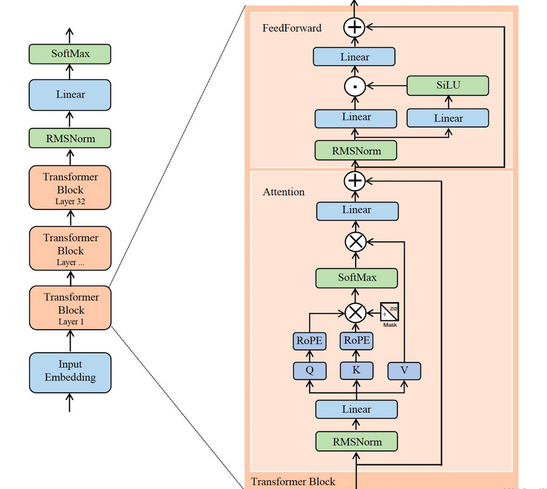
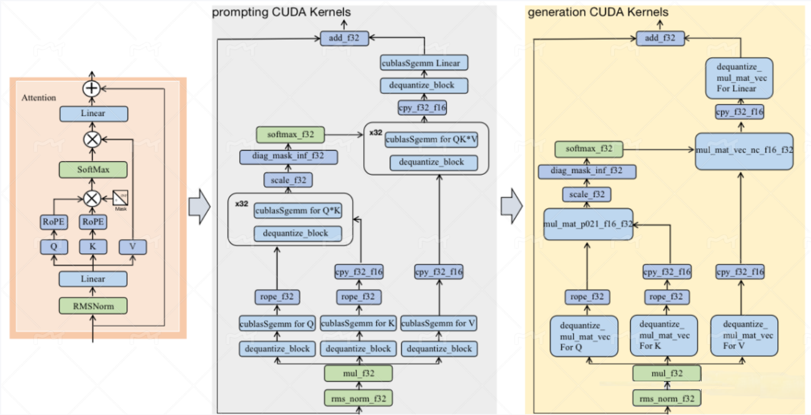
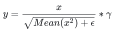
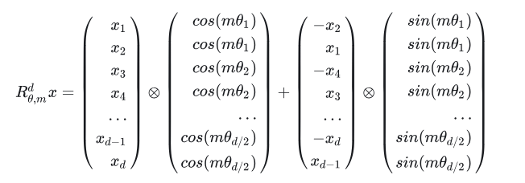
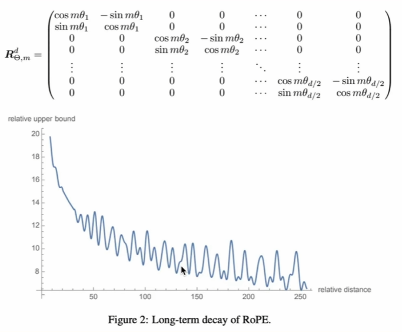

# llama.cpp cuda 版本 部分算子
大模型的推理可以分为prompt和generation两个阶段,prompt阶段是多token输入 input_tensor: [batch_size, seq_len, hidden_dim], generation阶段的输入则是 input_tensor: [batch_size, 1, hidden_dim]<br>
前者更多的计算算子是gemm，而后者更多的计算算子则是gemv <br>
大致了解一下  基础结构单元, 这些结构的kernel具体调用的哪个可以运行以便 nvproof 从Nsight Systems Profile report中直观的看到：<br>

<br>
我们从前往后开始逐个看kernel:<br>

### RMSNorm
这个kernel在前后版本中有改变.这些kernel改变主要来自于顶层调用该kernel时为了灵活改变粒度做的操作(再者就是为了适应不同量化精度)，如这个kernel是这样的（后续其他kernel修改的原因也相同，不做赘述）：<br>

```cpp
// 顶层调用
if (ncols < 1024) {
        const dim3 block_dims(WARP_SIZE, 1, 1);
        rms_norm_f32<WARP_SIZE><<<nrows, block_dims, 0, stream>>>(x, dst, ncols, eps);
    } else {
        const dim3 block_dims(1024, 1, 1);
        rms_norm_f32<1024><<<nrows, block_dims, 0, stream>>>(x, dst, ncols, eps);
    }
```

```cpp
// 较早版本，主要特点是：固定的blocksize，一行数据由一个Warp（32线程）负责，使用warp内通讯函数__shfl_xor_sync
static __global__ void rms_norm_f32(const float * x, float * dst, const int ncols, const float eps) {
    const int row = blockIdx.x*blockDim.y + threadIdx.y;
    const int tid = threadIdx.x;
​
    float tmp = 0.0f; // partial sum for thread in warp
    //一个线程求和(ncols/WARP_SIZE)个数据的x^2 
    for (int col = tid; col < ncols; col += WARP_SIZE) {
        const float xi = x[row*ncols + col];
        tmp += xi * xi;
    }
    
    // 一个线程束(32个线程)内的归约求和
#pragma unroll
    for (int mask = 16; mask > 0; mask >>= 1) {
        tmp += __shfl_xor_sync(0xffffffff, tmp, mask, 32);
    }
    
    const float mean = tmp / ncols; // mean(x^2)
    const float scale = rsqrtf(mean + eps); // 1/根号mean
    //算完之后写回原数组
    for (int col = tid; col < ncols; col += WARP_SIZE) {
        dst[row*ncols + col] = scale * x[row*ncols + col];
    }
}
```
```cpp
//当下版本
template <int block_size>
static __global__ void rms_norm_f32(const float * x, float * dst, const int ncols, const float eps) {
    const int row = blockIdx.x*blockDim.y + threadIdx.y;
    const int tid = threadIdx.x;

    x   += int64_t(row)*ncols;
    dst += int64_t(row)*ncols;

    float tmp = 0.0f; // 一个warp中的sum
    // 注意这里是一个线程求和(ncols/block_size)个数据的x^2
    for (int col = tid; col < ncols; col += block_size) {
        const float xi = x[col];
        tmp += xi * xi;
    }

    // 注意这一步仍然是先相加 warp内的sum
    tmp = warp_reduce_sum(tmp);
    if constexpr (block_size > WARP_SIZE) {
        //实际只有两种大小，要么WARPSIZE，要么1024
        static_assert(block_size == 1024, "unexpected block_size");
        //与以前不同，这里申请 shared mem了,注意这里的32 的意义为 1024/WARPSIZE  而非 WARPSIZE
        __shared__ float s_sum[32];
        const int warp_id = threadIdx.x / WARP_SIZE;
        const int lane_id = threadIdx.x % WARP_SIZE;
        // 因为之前是reduce sum 操作，每Warp内的值都一样，因此只有在warp内第0个才会被记录
        if (lane_id == 0) {
            s_sum[warp_id] = tmp;
        }
        __syncthreads();    //sync 在这里很有必要
        // 上面计算完成之后，其实每一个共享 shared mem 的block 内的线程根据lane_id所拿到的都是相同的32个数中的第lane_id个。这里其实是一个取巧的写法。
        tmp = s_sum[lane_id];
        // 对于每个线程来说计算得到的是相同的tmp结果,虽然有重复计算，但是减少了cuda程序的分支，其实更方便节省时间
        tmp = warp_reduce_sum(tmp);
    }

    const float mean = tmp / ncols;
    const float scale = rsqrtf(mean + eps);

    for (int col = tid; col < ncols; col += block_size) {
        dst[col] = scale * x[col];
    }
}
```

### quantize
quantize_q8_1 kernel用于对数据进行int8的对称均匀量化，具体而言，此时就是对输入shape为[1,1,4096]的fp32数据进行量化，girdDim ={16,1,1} , blockDim={256 , 1, 1} <br>

### RoPE
<br>
一般rope只会对Q和K进行位置编码。旋转位置编码主要出现背景：固定位置编码sin、cos对于长上下文输入的情况编码起来有些吃力了。<br>
旋转位置编码的原理简单概述：对于两个夹角相同的向量，他们旋转相同的角度之后，两者的点积不变。对于矩阵也是如此，因此对于q和k，乘以相同的旋转矩阵，q@k的结果不变。但此时，q和k已经带上了位置信息。https://nn.labml.ai/transformers/rope/index.html<br>
RoPE 随着上下文变长的效果：<br>

贴一个python的实现方便，实际llamacpp中没有python实现：<br>

```python
import torch
import torch.nn as nn

def rotate_half(x):
    x1, x2 = x.chunk(2, dim=-1)
    return torch.cat((-x2, x1), dim=-1)

def apply_rotate_pos_emb(q, k, cos, sin, unsqueeze_dim=2):
    
    cos = cos.unsqueeze(unsqueeze_dim)
    sin = sin.unsqueeze(unsqueeze_dim)
   
    q_embed = (q*cos) + (rotate_half(q)*sin)
    k_embed = (k*cos) + (rotate_half(k)*sin)
    
    return q_embed, k_embed

class RotaryEmbedding(nn.Module):
    def __init__(self, dim, max_seq_len=1024):
        super(RotaryEmbedding, self).__init__()
        self.dim = dim
        self.max_seq_len = max_seq_len
        inv_freq = 1.0 / (10000 ** (torch.arange(0, dim, 2).float() / dim))
        t = torch.arange(max_seq_len).float().unsqueeze(1)
        freqs = t @ inv_freq.unsqueeze(0)
        freqs = torch.cat((freqs, freqs), dim=-1)
        
        self.register_buffer("cos_cached", freqs.cos())
        self.register_buffer("sin_cached", freqs.sin())
        
    def forward(self, q, k):
        cos = self.cos_cached[:q.shape[1], :].unsqueeze(0)
        sin = self.sin_cached[:q.shape[1], :].unsqueeze(0)
        return apply_rotate_pos_emb(q, k, cos, sin)  
```

```cpp
static float rope_yarn_ramp(const float low, const float high, const int i0) {
    const float y = (i0 / 2 - low) / MAX(0.001f, high - low);
    return 1 - MIN(1, MAX(0, y));
}

static void rope_yarn(
    float theta_extrap, float freq_scale, float corr_dims[2], int64_t i0, float ext_factor, float mscale,
    float * cos_theta, float * sin_theta) {
    float theta_interp = freq_scale * theta_extrap;
    float theta = theta_interp;
    // 一般调用这个计算
    if (ext_factor != 0.0f) {
        float ramp_mix = rope_yarn_ramp(corr_dims[0], corr_dims[1], i0) * ext_factor;
        theta = theta_interp * (1 - ramp_mix) + theta_extrap * ramp_mix;

        mscale *= 1.0f + 0.1f * logf(1.0f / freq_scale);
    }
    *cos_theta = cosf(theta) * mscale;
    *sin_theta = sinf(theta) * mscale;
}
template<bool forward, bool has_ff, typename T>   /* <80,1,1> <1,256,1> */
static __global__ void rope_norm(
        const T * x, T * dst, const int ne0, const int ne1, const int s1, const int s2, const int n_dims,
        const int32_t * pos, const float freq_scale, const float ext_factor, const float attn_factor,
        const rope_corr_dims corr_dims, const float theta_scale, const float * freq_factors) {
    // take an instance: ne0 = 128, ne1 = 16, s1 = 128, s2 = 2048, n_dims = 128 
    // freq_scale = 1
    // ext_factor = 0
    // attn_factor = 1
    // corr_dims = {23, 40}
    // theta_scale = powf(freq_base, -2.0f/n_dims) = 0.805842161
    // 计算col 号， 输入参数中 ne0 是列数(某一维的维度)，ne1 是行数; 一个线程计算相邻的两个数的cos和sin; 这里的i0决定了powf 的指数参数是多少
    const int i0 = 2*(blockDim.y*blockIdx.y + threadIdx.y);
    //                256        0            0~255  

    if (i0 >= ne0) {    // 这里分配了256线程，但是实际使用的线程数目用 ne0截断了,增加了block 的 diversity，可能出现只有一半的线程执行了，另一半空置提前返回,(?)
        return;
    }
    // 计算row 号
    const int row_dst = blockDim.x*blockIdx.x + threadIdx.x;
    //                  1          0~80         0

    if (i0 >= n_dims) { // n_dims = 128 代表需要做rope freq 的维度
        const int i = row_dst*ne0 + i0;

        dst[i + 0] = x[i + 0];
        dst[i + 1] = x[i + 1];

        return;
    }

    const int row_x     = row_dst % ne1;    // ne1 = 16
    const int channel_x = row_dst / ne1;    // 每个通道16行

    const int idst = row_dst*ne0 + i0;
    const int ix   = channel_x*s2 + row_x*s1 + i0;  
    //channel_x (0~80分成 5个16行)*2048 + row_x(0~15)*128+i0(0~127)*2

    const float theta_base = pos[channel_x]*powf(theta_scale, i0/2.0f);

    const float freq_factor = has_ff ? freq_factors[i0/2] : 1.0f;

    float cos_theta;
    float sin_theta;

    rope_yarn(theta_base/freq_factor, freq_scale, corr_dims, i0, ext_factor, attn_factor, cos_theta, sin_theta);

    // 上面的部分都相当于在求 矩阵中对应位置的相应的freq 分量
    const float x0 = x[ix + 0];
    const float x1 = x[ix + 1];

    dst[idst + 0] = x0*cos_theta - x1*sin_theta;
    dst[idst + 1] = x0*sin_theta + x1*cos_theta;
}
```

### mat_mul
注意rms_norm_f32这个kernel 在prompting阶段处理的tensor shape 是[1, seq_len , 4096] ，nrows 等于seq_len，在generation阶段处理的tensor shape 则是[1, 1 , 4096] <br>
```cpp
template <typename T, typename type_acc, int block_size>
static __global__ void mul_mat_vec(
        const T * __restrict__ x, const float * __restrict__ y, float * __restrict__ dst, const int64_t ncols2, const int64_t stride_row,
        const int64_t channel_ratio, const int64_t stride_channel_x, const int64_t stride_channel_y, const int64_t stride_channel_dst) {
    const int64_t row     = blockIdx.x;
    const int64_t channel = blockIdx.z;
    const int     tid     = threadIdx.x;

    x   += (channel/channel_ratio)*stride_channel_x + row*stride_row;
    y   +=  channel               *stride_channel_y;
    dst +=  channel               *stride_channel_dst;

    const float2 * y2 = (const float2 *) y;

    extern __shared__ char data_mmv[];
    float * buf_iw = (float *) data_mmv;

    if (block_size > WARP_SIZE) {
        if (tid < WARP_SIZE) {
            buf_iw[tid] = 0.0f;
        }
        __syncthreads();
    }

    float sumf;

    if constexpr (std::is_same<T, half>::value) {
        const half2 * x2 = (const half2 *) x;

        if (std::is_same<type_acc, float>::value) {
            sumf = 0.0f;

            for (int64_t col2 = tid; col2 < ncols2; col2 += block_size) {
                const float2 tmpx = __half22float2(x2[col2]);
                const float2 tmpy = y2[col2];
                sumf += tmpx.x * tmpy.x;
                sumf += tmpx.y * tmpy.y;
            }
        } else {
#ifdef FP16_AVAILABLE
            half2 sumh2 = make_half2(0.0f, 0.0f);

            for (int64_t col2 = tid; col2 < ncols2; col2 += block_size) {
                const float2 tmp = y2[col2];
                sumh2 += x2[col2] * make_half2(tmp.x, tmp.y);
            }

            sumf = __low2float(sumh2) + __high2float(sumh2);
#else
            NO_DEVICE_CODE;
#endif // FP16_AVAILABLE
        }
    } else if constexpr (std::is_same<T, nv_bfloat16>::value) {
        const int * x2 = (const int *) x;
        sumf = 0.0f;

        for (int64_t col2 = tid; col2 < ncols2; col2 += block_size) {
            const int    tmpx = x2[col2];
            const float2 tmpy = y2[col2];
            sumf += float(reinterpret_cast<const nv_bfloat16 *>(&tmpx)[0]) * tmpy.x;
            sumf += float(reinterpret_cast<const nv_bfloat16 *>(&tmpx)[1]) * tmpy.y;
        }
    } else {
        static_assert(std::is_same<T, void>::value, "unsupported type");
    }

    sumf = warp_reduce_sum(sumf);

    if (block_size > WARP_SIZE) {
        buf_iw[tid/WARP_SIZE] = sumf;
        __syncthreads();
        if (tid >= WARP_SIZE) {
            return;
        }
        sumf = buf_iw[tid];
        sumf = warp_reduce_sum(sumf);
    }

    if (tid != 0) {
        return;
    }

    dst[row] = sumf;
}
```